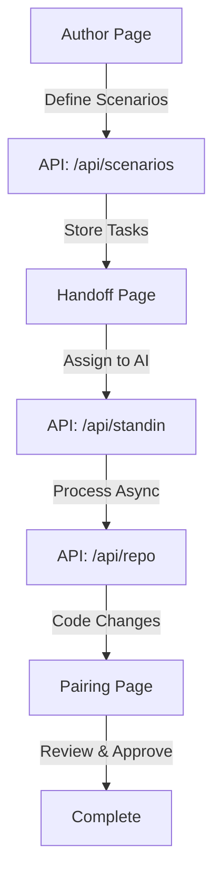

**User:**

<task>
Plan, then scaffold a web app called <NAME>: an async pair-programming tool. Use Next.js with TypeScript (App Router) and Tailwind CSS. Create pages /author, /handoff, /pairing and API route stubs /api/scenarios, /api/standin, /api/repo, plus a lib/ folder. Add .gitignore and .bobignore that exclude .env.
</task>
<environment_details>
# VSCode Visible Files
../../../../../../extension-output-IBM.bob-code-#1-IBM Bob,../../../../Downloads/bob_task_may-16-2026_4-21-58-am.md

# VSCode Open Tabs
../../../../Downloads/bob_task_may-16-2026_4-21-58-am.md

# Current Time
Current time in ISO 8601 UTC format: 2026-05-16T08:36:36.919Z
User time zone: America/New_York, UTC-4:00

# Current Cost
$0.00

# Review Exclusions
The following file patterns are excluded from code reviews:
- .vscode/**

# Current Mode
<slug>plan</slug>
<name>📝 Plan</name>


# Current Workspace Directory (/Users/hylbert/Documents/programming/hackathon/ibm-bob-hackathon-main) Files
README.md
You have not created a todo list yet. Create one with `update_todo_list` if your task is complicated or involves multiple steps.
</environment_details>

---

**Assistant:**

I'll help you plan and scaffold this async pair-programming web app. Let me start by gathering some context and asking clarifying questions.

<read_file>
<args>
  <file>
    <path>README.md</path>
  </file>
</args>
</read_file>

---

**User:**

[read_file for 'README.md'. Reading multiple files at once is more efficient for the LLM. If other files are relevant to your current task, please read them simultaneously.] Result:
<files>
<file><path>README.md</path>
<content lines="1-25">
 1 | # IBM Bob Hackathon
 2 | 
 3 | A project built for the **IBM Bob Hackathon** — *"Your repo. Your rules. AI as your dev partner."*
 4 | 
 5 | > Build solutions that improve how software is built, using IBM Bob as an AI-powered development partner.
 6 | 
 7 | ## Challenge
 8 | 
 9 | **Turn idea into impact faster.** Create a solution that speeds up everyday development work — getting up to speed on existing code, generating documentation and tests, or reducing repetitive tasks.
10 | 
11 | ## Status
12 | 
13 | 🚧 Project in progress. Concept and implementation details to be added.
14 | 
15 | ## Event
16 | 
17 | - **When:** May 15–17, 2026 (48-hour build, fully online)
18 | - **Submission deadline:** May 17, 2026, 11:00 AM ET
19 | - **Prize pool:** $10,000
20 | 
21 | See the `prepare` branch for the full hackathon brief, judging criteria, and submission requirements.
22 | 
23 | ## License
24 | 
25 | MIT
</content>
</file>
</files>
<environment_details>
# VSCode Visible Files
../../../../../../extension-output-IBM.bob-code-#1-IBM Bob,../../../../Downloads/bob_task_may-16-2026_4-21-58-am.md

# VSCode Open Tabs
../../../../Downloads/bob_task_may-16-2026_4-21-58-am.md

# Current Time
Current time in ISO 8601 UTC format: 2026-05-16T08:36:39.127Z
User time zone: America/New_York, UTC-4:00

# Current Cost
$0.03

# Review Exclusions
The following file patterns are excluded from code reviews:
- .vscode/**

# Current Mode
<slug>plan</slug>
<name>📝 Plan</name>
You have not created a todo list yet. Create one with `update_todo_list` if your task is complicated or involves multiple steps.
</environment_details>

---

**Assistant:**

<ask_followup_question>
<question>I need a few clarifications to create the best plan for your async pair-programming tool:

1. What should the app name be? (You mentioned <NAME> as a placeholder)
2. What's the core workflow? For example: Author creates a task → Handoff to AI/partner → Pairing session to review?
3. Should the API routes be functional stubs (with mock data) or just empty route handlers?
4. Do you need any specific dependencies beyond Next.js, TypeScript, and Tailwind (e.g., database client, auth library)?</question>
<follow_up>
<suggest>Name: "PairFlow" | Workflow: Author writes task specs → Handoff assigns to AI standin → Pairing reviews results | Mock data stubs | No additional deps for now</suggest>
<suggest>Name: "AsyncPair" | Workflow: Author defines scenarios → Standin AI works async → Pairing session for review | Empty route handlers | Add Prisma + NextAuth later</suggest>
<suggest>Name: "DevHandoff" | Workflow: Create coding tasks → AI partner implements → Review in pairing mode | Functional stubs with mock responses | Keep it minimal for now</suggest>
<suggest>Let me decide the details and create a comprehensive plan</suggest>
</follow_up>
</ask_followup_question>

---

**User:**

[ask_followup_question for 'I need a few clarifications to create the best plan for your async pair-programming tool:

1. What should the app name be? (You mentioned <NAME> as a placeholder)
2. What's the core workflow? For example: Author creates a task → Handoff to AI/partner → Pairing session to review?
3. Should the API routes be functional stubs (with mock data) or just empty route handlers?
4. Do you need any specific dependencies beyond Next.js, TypeScript, and Tailwind (e.g., database client, auth library)?'] Result:
<answer>
Name: "AsyncPair" | Workflow: Author defines scenarios → Standin AI works async → Pairing session for review | Empty route handlers | Add Prisma + NextAuth later
</answer>
<environment_details>
# VSCode Visible Files
../../../../../../extension-output-IBM.bob-code-#1-IBM Bob,../../../../Downloads/bob_task_may-16-2026_4-21-58-am.md

# VSCode Open Tabs
../../../../Downloads/bob_task_may-16-2026_4-21-58-am.md

# Current Time
Current time in ISO 8601 UTC format: 2026-05-16T08:37:03.603Z
User time zone: America/New_York, UTC-4:00

# Current Cost
$0.06

# Review Exclusions
The following file patterns are excluded from code reviews:
- .vscode/**

# Current Mode
<slug>plan</slug>
<name>📝 Plan</name>
You have not created a todo list yet. Create one with `update_todo_list` if your task is complicated or involves multiple steps.
</environment_details>

---

**Assistant:**

Perfect! Now I have a clear understanding. Let me create a comprehensive plan for scaffolding **AsyncPair**, your async pair-programming tool.

<update_todo_list>
<todos>
[ ] Initialize Next.js project with TypeScript and App Router
[ ] Configure Tailwind CSS
[ ] Create project structure with lib/ folder
[ ] Create /author page for defining coding scenarios
[ ] Create /handoff page for task assignment and status
[ ] Create /pairing page for reviewing AI-generated code
[ ] Create API route stub /api/scenarios
[ ] Create API route stub /api/standin
[ ] Create API route stub /api/repo
[ ] Add .gitignore with .env exclusion
[ ] Add .bobignore with .env exclusion
[ ] Create package.json with necessary dependencies
[ ] Add basic TypeScript configuration
[ ] Create README.md with project overview
</todos>
</update_todo_list>

---

**User:**

[update_todo_list] Result:
Todo list updated successfully.
<environment_details>
# VSCode Visible Files
../../../../../../extension-output-IBM.bob-code-#1-IBM Bob,../../../../Downloads/bob_task_may-16-2026_4-21-58-am.md

# VSCode Open Tabs
../../../../Downloads/bob_task_may-16-2026_4-21-58-am.md

# Current Time
Current time in ISO 8601 UTC format: 2026-05-16T08:37:11.023Z
User time zone: America/New_York, UTC-4:00

# Current Cost
$0.09

# Review Exclusions
The following file patterns are excluded from code reviews:
- .vscode/**

# Current Mode
<slug>plan</slug>
<name>📝 Plan</name>
====

REMINDERS

Below is your current list of reminders for this task. Keep them updated as you progress.

| # | Content | Status |
|---|---------|--------|
| 1 | Initialize Next.js project with TypeScript and App Router | Pending |
| 2 | Configure Tailwind CSS | Pending |
| 3 | Create project structure with lib/ folder | Pending |
| 4 | Create /author page for defining coding scenarios | Pending |
| 5 | Create /handoff page for task assignment and status | Pending |
| 6 | Create /pairing page for reviewing AI-generated code | Pending |
| 7 | Create API route stub /api/scenarios | Pending |
| 8 | Create API route stub /api/standin | Pending |
| 9 | Create API route stub /api/repo | Pending |
| 10 | Add .gitignore with .env exclusion | Pending |
| 11 | Add .bobignore with .env exclusion | Pending |
| 12 | Create package.json with necessary dependencies | Pending |
| 13 | Add basic TypeScript configuration | Pending |
| 14 | Create README.md with project overview | Pending |


IMPORTANT: When task status changes, remember to call the `update_todo_list` tool to update your progress.

</environment_details>

---

**Assistant:**

Excellent! I've created a detailed todo list for scaffolding **AsyncPair**. Let me now provide you with a comprehensive architectural plan.

## AsyncPair - Async Pair-Programming Tool

### Architecture Overview



### Project Structure

```
asyncpair/
├── app/
│   ├── author/
│   │   └── page.tsx          # Define coding scenarios
│   ├── handoff/
│   │   └── page.tsx          # Task assignment & status
│   ├── pairing/
│   │   └── page.tsx          # Review AI-generated code
│   ├── api/
│   │   ├── scenarios/
│   │   │   └── route.ts      # Scenario CRUD operations
│   │   ├── standin/
│   │   │   └── route.ts      # AI standin processing
│   │   └── repo/
│   │       └── route.ts      # Repository operations
│   ├── layout.tsx            # Root layout with navigation
│   └── page.tsx              # Landing page
├── lib/
│   ├── types.ts              # TypeScript interfaces
│   ├── utils.ts              # Utility functions
│   └── constants.ts          # App constants
├── public/                   # Static assets
├── .gitignore
├── .bobignore
├── package.json
├── tsconfig.json
├── tailwind.config.ts
├── postcss.config.js
└── next.config.js
```

### Core Features by Page

#### 1. **Author Page** [`/author`](app/author/page.tsx)
- Form to define coding scenarios
- Specify requirements, constraints, test cases
- Submit scenarios to [`/api/scenarios`](app/api/scenarios/route.ts)

#### 2. **Handoff Page** [`/handoff`](app/handoff/page.tsx)
- View pending scenarios
- Assign to AI standin
- Monitor async processing status
- Trigger [`/api/standin`](app/api/standin/route.ts) for AI work

#### 3. **Pairing Page** [`/pairing`](app/pairing/page.tsx)
- Side-by-side diff view
- Review AI-generated code changes
- Accept/reject/request modifications
- Fetch results from [`/api/repo`](app/api/repo/route.ts)

### API Routes

#### [`/api/scenarios`](app/api/scenarios/route.ts)
```typescript
// GET: List all scenarios
// POST: Create new scenario
// PUT: Update scenario
// DELETE: Remove scenario
```

#### [`/api/standin`](app/api/standin/route.ts)
```typescript
// POST: Trigger AI standin to process scenario
// GET: Check standin processing status
```

#### [`/api/repo`](app/api/repo/route.ts)
```typescript
// GET: Fetch repository state and changes
// POST: Apply approved changes
```

### Technology Stack

- **Framework**: Next.js 14+ (App Router)
- **Language**: TypeScript
- **Styling**: Tailwind CSS
- **Future additions**: Prisma (DB), NextAuth (Auth)

### Key TypeScript Interfaces

```typescript
interface Scenario {
  id: string;
  title: string;
  description: string;
  requirements: string[];
  constraints?: string[];
  status: 'draft' | 'pending' | 'processing' | 'ready' | 'completed';
  createdAt: Date;
}

interface CodeChange {
  file: string;
  diff: string;
  status: 'pending' | 'approved' | 'rejected';
}

interface StandinResult {
  scenarioId: string;
  changes: CodeChange[];
  summary: string;
  completedAt: Date;
}
```

### Configuration Files

- **[`.gitignore`](.gitignore)**: Exclude node_modules, .next, .env, build artifacts
- **[`.bobignore`](.bobignore)**: Exclude .env for Bob AI operations
- **[`tsconfig.json`](tsconfig.json)**: Strict TypeScript with path aliases
- **[`tailwind.config.ts`](tailwind.config.ts)**: Custom theme configuration

### Development Workflow

1. **Author** creates a coding scenario with requirements
2. **Handoff** assigns the scenario to AI standin for async processing
3. AI standin works independently, generating code changes
4. **Pairing** session allows developer to review, discuss, and approve changes
5. Approved changes are applied to the repository

### Next Steps After Scaffolding

- Implement actual API logic (currently empty stubs)
- Add Prisma for data persistence
- Integrate NextAuth for user authentication
- Connect to AI service (IBM watsonx, OpenAI, etc.)
- Add real-time status updates (WebSockets/SSE)
- Implement diff viewer component
- Add test coverage

---

**Does this plan align with your vision for AsyncPair?** Would you like me to:
- Adjust the architecture or workflow?
- Add/remove any pages or API routes?
- Include additional features in the initial scaffold?

Once you approve, I'll switch to Code mode to implement this structure.

---

**User:**

[ERROR] You did not use a tool in your previous response! Please retry with a tool use.

# Reminder: Instructions for Tool Use

Tool uses are formatted using XML-style tags. The tool name itself becomes the XML tag name. Each parameter is enclosed within its own set of tags. Here's the structure:

<actual_tool_name>
<parameter1_name>value1</parameter1_name>
<parameter2_name>value2</parameter2_name>
...
</actual_tool_name>

For example, to use the attempt_completion tool:

<attempt_completion>
<result>
I have completed the task...
</result>
</attempt_completion>

Always use the actual tool name as the XML tag name for proper parsing and execution.

# Next Steps

If you have completed the user's task, use the attempt_completion tool.
If you require additional information from the user, use the ask_followup_question tool.
Otherwise, if you have not completed the task and do not need additional information, then proceed with the next step of the task.
(This is an automated message, so do not respond to it conversationally.)
<environment_details>
# VSCode Visible Files
../../../../../../extension-output-IBM.bob-code-#1-IBM Bob,../../../../Downloads/bob_task_may-16-2026_4-21-58-am.md

# VSCode Open Tabs
../../../../Downloads/bob_task_may-16-2026_4-21-58-am.md

# Current Time
Current time in ISO 8601 UTC format: 2026-05-16T08:37:30.223Z
User time zone: America/New_York, UTC-4:00

# Current Cost
$0.13

# Review Exclusions
The following file patterns are excluded from code reviews:
- .vscode/**

# Current Mode
<slug>plan</slug>
<name>📝 Plan</name>
====

REMINDERS

Below is your current list of reminders for this task. Keep them updated as you progress.

| # | Content | Status |
|---|---------|--------|
| 1 | Initialize Next.js project with TypeScript and App Router | Pending |
| 2 | Configure Tailwind CSS | Pending |
| 3 | Create project structure with lib/ folder | Pending |
| 4 | Create /author page for defining coding scenarios | Pending |
| 5 | Create /handoff page for task assignment and status | Pending |
| 6 | Create /pairing page for reviewing AI-generated code | Pending |
| 7 | Create API route stub /api/scenarios | Pending |
| 8 | Create API route stub /api/standin | Pending |
| 9 | Create API route stub /api/repo | Pending |
| 10 | Add .gitignore with .env exclusion | Pending |
| 11 | Add .bobignore with .env exclusion | Pending |
| 12 | Create package.json with necessary dependencies | Pending |
| 13 | Add basic TypeScript configuration | Pending |
| 14 | Create README.md with project overview | Pending |


IMPORTANT: When task status changes, remember to call the `update_todo_list` tool to update your progress.

</environment_details>

---

**Assistant:**

<ask_followup_question>
<question>I've created a comprehensive plan for AsyncPair with the architecture, project structure, and workflow. The todo list is ready with 14 actionable steps. Would you like me to proceed with implementing this scaffold, or would you prefer to review and adjust the plan first?</question>
<follow_up>
<suggest mode="code">Proceed with implementation - switch to Code mode and scaffold the entire project</suggest>
<suggest>Adjust the plan - I want to modify the architecture or add/remove features</suggest>
<suggest>Review the API routes - I need more details about the API structure before proceeding</suggest>
<suggest mode="code">Start implementation but create a simpler version first with just the core pages</suggest>
</follow_up>
</ask_followup_question>

---

**User:**

[ask_followup_question for 'I've created a comprehensive plan for AsyncPair with the architecture, project structure, and workflow. The todo list is ready with 14 actionable steps. Would you like me to proceed with implementing this scaffold, or would you prefer to review and adjust the plan first?'] Result:
<answer>
Proceed with implementation - switch to Code mode and scaffold the entire project
</answer>
<environment_details>
# VSCode Visible Files
../../../../../../extension-output-IBM.bob-code-#1-IBM Bob,../../../../Downloads/bob_task_may-16-2026_4-21-58-am.md

# VSCode Open Tabs
../../../../Downloads/bob_task_may-16-2026_4-21-58-am.md

# Current Time
Current time in ISO 8601 UTC format: 2026-05-16T08:38:35.183Z
User time zone: America/New_York, UTC-4:00

# Current Cost
$0.17

# Review Exclusions
The following file patterns are excluded from code reviews:
- .vscode/**

# Current Mode
<slug>plan</slug>
<name>📝 Plan</name>
====

REMINDERS

Below is your current list of reminders for this task. Keep them updated as you progress.

| # | Content | Status |
|---|---------|--------|
| 1 | Initialize Next.js project with TypeScript and App Router | Pending |
| 2 | Configure Tailwind CSS | Pending |
| 3 | Create project structure with lib/ folder | Pending |
| 4 | Create /author page for defining coding scenarios | Pending |
| 5 | Create /handoff page for task assignment and status | Pending |
| 6 | Create /pairing page for reviewing AI-generated code | Pending |
| 7 | Create API route stub /api/scenarios | Pending |
| 8 | Create API route stub /api/standin | Pending |
| 9 | Create API route stub /api/repo | Pending |
| 10 | Add .gitignore with .env exclusion | Pending |
| 11 | Add .bobignore with .env exclusion | Pending |
| 12 | Create package.json with necessary dependencies | Pending |
| 13 | Add basic TypeScript configuration | Pending |
| 14 | Create README.md with project overview | Pending |


IMPORTANT: When task status changes, remember to call the `update_todo_list` tool to update your progress.

</environment_details>

---

**Assistant:**

<switch_mode>
<mode_slug>code</mode_slug>
<reason>User approved the plan. Switching to Code mode to scaffold the AsyncPair web application with Next.js, TypeScript, Tailwind CSS, all required pages (/author, /handoff, /pairing), API routes (/api/scenarios, /api/standin, /api/repo), lib/ folder, and configuration files (.gitignore, .bobignore).</reason>
</switch_mode>

---

**User:**

[switch_mode to 'code' because: User approved the plan. Switching to Code mode to scaffold the AsyncPair web application with Next.js, TypeScript, Tailwind CSS, all required pages (/author, /handoff, /pairing), API routes (/api/scenarios, /api/standin, /api/repo), lib/ folder, and configuration files (.gitignore, .bobignore).] Result:
Successfully switched from 📝 Plan mode to 💻 Code mode because: User approved the plan. Switching to Code mode to scaffold the AsyncPair web application with Next.js, TypeScript, Tailwind CSS, all required pages (/author, /handoff, /pairing), API routes (/api/scenarios, /api/standin, /api/repo), lib/ folder, and configuration files (.gitignore, .bobignore)..
<environment_details>
# VSCode Visible Files
../../../../../../extension-output-IBM.bob-code-#1-IBM Bob,../../../../Downloads/bob_task_may-16-2026_4-21-58-am.md

# VSCode Open Tabs
../../../../Downloads/bob_task_may-16-2026_4-21-58-am.md

# Current Time
Current time in ISO 8601 UTC format: 2026-05-16T08:38:38.770Z
User time zone: America/New_York, UTC-4:00

# Current Cost
$0.22

# Review Exclusions
The following file patterns are excluded from code reviews:
- .vscode/**

# Current Mode
<slug>code</slug>
<name>💻 Code</name>
====

REMINDERS

Below is your current list of reminders for this task. Keep them updated as you progress.

| # | Content | Status |
|---|---------|--------|
| 1 | Initialize Next.js project with TypeScript and App Router | Pending |
| 2 | Configure Tailwind CSS | Pending |
| 3 | Create project structure with lib/ folder | Pending |
| 4 | Create /author page for defining coding scenarios | Pending |
| 5 | Create /handoff page for task assignment and status | Pending |
| 6 | Create /pairing page for reviewing AI-generated code | Pending |
| 7 | Create API route stub /api/scenarios | Pending |
| 8 | Create API route stub /api/standin | Pending |
| 9 | Create API route stub /api/repo | Pending |
| 10 | Add .gitignore with .env exclusion | Pending |
| 11 | Add .bobignore with .env exclusion | Pending |
| 12 | Create package.json with necessary dependencies | Pending |
| 13 | Add basic TypeScript configuration | Pending |
| 14 | Create README.md with project overview | Pending |


IMPORTANT: When task status changes, remember to call the `update_todo_list` tool to update your progress.

</environment_details>

---

**Assistant:**

Perfect! Now I'm in Code mode. Let me start scaffolding the AsyncPair project. I'll begin by creating the package.json with all necessary dependencies.

<write_to_file>
<path>package.json</path>
<content>
{
  "name": "asyncpair",
  "version": "0.1.0",
  "private": true,
  "scripts": {
    "dev": "next dev",
    "build": "next build",
    "start": "next start",
    "lint": "next lint"
  },
  "dependencies": {
    "next": "14.2.3",
    "react": "^18.3.1",
    "react-dom": "^18.3.1"
  },
  "devDependencies": {
    "@types/node": "^20.12.12",
    "@types/react": "^18.3.2",
    "@types/react-dom": "^18.3.0",
    "autoprefixer": "^10.4.19",
    "postcss": "^8.4.38",
    "tailwindcss": "^3.4.3",
    "typescript": "^5.4.5"
  }
}
</content>
<line_count>24</line_count>
</write_to_file>

---

**User:**

[write_to_file for 'package.json'] Result:
<file_write_result>
<path>package.json</path>
<operation>created</operation>
<notice>
<i>You do not need to re-read the file, as you have seen all changes</i>
<i>Proceed with the task using these changes as the new baseline.</i>
</notice>
</file_write_result>

<environment_details>
# VSCode Visible Files
../../../../../../extension-output-IBM.bob-code-#1-IBM Bob,package.json

# VSCode Open Tabs
package.json

# Current Time
Current time in ISO 8601 UTC format: 2026-05-16T08:38:44.590Z
User time zone: America/New_York, UTC-4:00

# Current Cost
$0.24

# Review Exclusions
The following file patterns are excluded from code reviews:
- .vscode/**

# Current Mode
<slug>code</slug>
<name>💻 Code</name>
====

REMINDERS

Below is your current list of reminders for this task. Keep them updated as you progress.

| # | Content | Status |
|---|---------|--------|
| 1 | Initialize Next.js project with TypeScript and App Router | Pending |
| 2 | Configure Tailwind CSS | Pending |
| 3 | Create project structure with lib/ folder | Pending |
| 4 | Create /author page for defining coding scenarios | Pending |
| 5 | Create /handoff page for task assignment and status | Pending |
| 6 | Create /pairing page for reviewing AI-generated code | Pending |
| 7 | Create API route stub /api/scenarios | Pending |
| 8 | Create API route stub /api/standin | Pending |
| 9 | Create API route stub /api/repo | Pending |
| 10 | Add .gitignore with .env exclusion | Pending |
| 11 | Add .bobignore with .env exclusion | Pending |
| 12 | Create package.json with necessary dependencies | Pending |
| 13 | Add basic TypeScript configuration | Pending |
| 14 | Create README.md with project overview | Pending |


IMPORTANT: When task status changes, remember to call the `update_todo_list` tool to update your progress.

</environment_details>

---

**Assistant:**

<write_to_file>
<path>tsconfig.json</path>
<content>
{
  "compilerOptions": {
    "lib": ["dom", "dom.iterable", "esnext"],
    "allowJs": true,
    "skipLibCheck": true,
    "strict": true,
    "noEmit": true,
    "esModuleInterop": true,
    "module": "esnext",
    "moduleResolution": "bundler",
    "resolveJsonModule": true,
    "isolatedModules": true,
    "jsx": "preserve",
    "incremental": true,
    "plugins": [
      {
        "name": "next"
      }
    ],
    "paths": {
      "@/*": ["./*"]
    }
  },
  "include": ["next-env.d.ts", "**/*.ts", "**/*.tsx", ".next/types/**/*.ts"],
  "exclude": ["node_modules"]
}
</content>
<line_count>26</line_count>
</write_to_file>

---

**User:**

[write_to_file for 'tsconfig.json'] Result:
<file_write_result>
<path>tsconfig.json</path>
<operation>created</operation>
<notice>
<i>You do not need to re-read the file, as you have seen all changes</i>
<i>Proceed with the task using these changes as the new baseline.</i>
</notice>
</file_write_result>

<environment_details>
# VSCode Visible Files
../../../../../../extension-output-IBM.bob-code-#1-IBM Bob,tsconfig.json

# VSCode Open Tabs
package.json,tsconfig.json

# Current Time
Current time in ISO 8601 UTC format: 2026-05-16T08:38:49.231Z
User time zone: America/New_York, UTC-4:00

# Current Cost
$0.26

# Review Exclusions
The following file patterns are excluded from code reviews:
- .vscode/**

# Current Mode
<slug>code</slug>
<name>💻 Code</name>
====

REMINDERS

Below is your current list of reminders for this task. Keep them updated as you progress.

| # | Content | Status |
|---|---------|--------|
| 1 | Initialize Next.js project with TypeScript and App Router | Pending |
| 2 | Configure Tailwind CSS | Pending |
| 3 | Create project structure with lib/ folder | Pending |
| 4 | Create /author page for defining coding scenarios | Pending |
| 5 | Create /handoff page for task assignment and status | Pending |
| 6 | Create /pairing page for reviewing AI-generated code | Pending |
| 7 | Create API route stub /api/scenarios | Pending |
| 8 | Create API route stub /api/standin | Pending |
| 9 | Create API route stub /api/repo | Pending |
| 10 | Add .gitignore with .env exclusion | Pending |
| 11 | Add .bobignore with .env exclusion | Pending |
| 12 | Create package.json with necessary dependencies | Pending |
| 13 | Add basic TypeScript configuration | Pending |
| 14 | Create README.md with project overview | Pending |


IMPORTANT: When task status changes, remember to call the `update_todo_list` tool to update your progress.

</environment_details>

---

**Assistant:**

<write_to_file>
<path>tailwind.config.ts</path>
<content>
import type { Config } from "tailwindcss";

const config: Config = {
  content: [
    "./pages/**/*.{js,ts,jsx,tsx,mdx}",
    "./components/**/*.{js,ts,jsx,tsx,mdx}",
    "./app/**/*.{js,ts,jsx,tsx,mdx}",
  ],
  theme: {
    extend: {
      colors: {
        background: "var(--background)",
        foreground: "var(--foreground)",
      },
    },
  },
  plugins: [],
};
export default config;
</content>
<line_count>18</line_count>
</write_to_file>

---

**User:**

[write_to_file for 'tailwind.config.ts'] Result:
<file_write_result>
<path>tailwind.config.ts</path>
<operation>created</operation>
<problems>

New problems detected after saving the file:
tailwind.config.ts
- [ts Error] 1 | import type { Config } from "tailwindcss"; : Cannot find module 'tailwindcss' or its corresponding type declarations.</problems>
<notice>
<i>You do not need to re-read the file, as you have seen all changes</i>
<i>Proceed with the task using these changes as the new baseline.</i>
</notice>
</file_write_result>

<environment_details>
# VSCode Visible Files
../../../../../../extension-output-IBM.bob-code-#1-IBM Bob,tailwind.config.ts

# VSCode Open Tabs
package.json,tailwind.config.ts

# Current Time
Current time in ISO 8601 UTC format: 2026-05-16T08:38:54.684Z
User time zone: America/New_York, UTC-4:00

# Current Cost
$0.29

# Review Exclusions
The following file patterns are excluded from code reviews:
- .vscode/**

# Current Mode
<slug>code</slug>
<name>💻 Code</name>
====

REMINDERS

Below is your current list of reminders for this task. Keep them updated as you progress.

| # | Content | Status |
|---|---------|--------|
| 1 | Initialize Next.js project with TypeScript and App Router | Pending |
| 2 | Configure Tailwind CSS | Pending |
| 3 | Create project structure with lib/ folder | Pending |
| 4 | Create /author page for defining coding scenarios | Pending |
| 5 | Create /handoff page for task assignment and status | Pending |
| 6 | Create /pairing page for reviewing AI-generated code | Pending |
| 7 | Create API route stub /api/scenarios | Pending |
| 8 | Create API route stub /api/standin | Pending |
| 9 | Create API route stub /api/repo | Pending |
| 10 | Add .gitignore with .env exclusion | Pending |
| 11 | Add .bobignore with .env exclusion | Pending |
| 12 | Create package.json with necessary dependencies | Pending |
| 13 | Add basic TypeScript configuration | Pending |
| 14 | Create README.md with project overview | Pending |


IMPORTANT: When task status changes, remember to call the `update_todo_list` tool to update your progress.

</environment_details>

---

**Assistant:**

<write_to_file>
<path>postcss.config.js</path>
<content>
module.exports = {
  plugins: {
    tailwindcss: {},
    autoprefixer: {},
  },
}
</content>
<line_count>6</line_count>
</write_to_file>

---

**User:**

[write_to_file for 'postcss.config.js'] Result:
<file_write_result>
<path>postcss.config.js</path>
<operation>created</operation>
<notice>
<i>You do not need to re-read the file, as you have seen all changes</i>
<i>Proceed with the task using these changes as the new baseline.</i>
</notice>
</file_write_result>

<environment_details>
# VSCode Visible Files
../../../../../../extension-output-IBM.bob-code-#1-IBM Bob,postcss.config.js

# VSCode Open Tabs
package.json,tailwind.config.ts,postcss.config.js

# Current Time
Current time in ISO 8601 UTC format: 2026-05-16T08:38:58.089Z
User time zone: America/New_York, UTC-4:00

# Current Cost
$0.32

# Review Exclusions
The following file patterns are excluded from code reviews:
- .vscode/**

# Current Mode
<slug>code</slug>
<name>💻 Code</name>
====

REMINDERS

Below is your current list of reminders for this task. Keep them updated as you progress.

| # | Content | Status |
|---|---------|--------|
| 1 | Initialize Next.js project with TypeScript and App Router | Pending |
| 2 | Configure Tailwind CSS | Pending |
| 3 | Create project structure with lib/ folder | Pending |
| 4 | Create /author page for defining coding scenarios | Pending |
| 5 | Create /handoff page for task assignment and status | Pending |
| 6 | Create /pairing page for reviewing AI-generated code | Pending |
| 7 | Create API route stub /api/scenarios | Pending |
| 8 | Create API route stub /api/standin | Pending |
| 9 | Create API route stub /api/repo | Pending |
| 10 | Add .gitignore with .env exclusion | Pending |
| 11 | Add .bobignore with .env exclusion | Pending |
| 12 | Create package.json with necessary dependencies | Pending |
| 13 | Add basic TypeScript configuration | Pending |
| 14 | Create README.md with project overview | Pending |


IMPORTANT: When task status changes, remember to call the `update_todo_list` tool to update your progress.

</environment_details>

---

**Assistant:**

<write_to_file>
<path>next.config.js</path>
<content>
/** @type {import('next').NextConfig} */
const nextConfig = {}

module.exports = nextConfig
</content>
<line_count>4</line_count>
</write_to_file>

---

**User:**

[write_to_file for 'next.config.js'] Result:
<file_write_result>
<path>next.config.js</path>
<operation>created</operation>
<notice>
<i>You do not need to re-read the file, as you have seen all changes</i>
<i>Proceed with the task using these changes as the new baseline.</i>
</notice>
</file_write_result>

<environment_details>
# VSCode Visible Files
../../../../../../extension-output-IBM.bob-code-#1-IBM Bob,next.config.js

# VSCode Open Tabs
package.json,tailwind.config.ts,postcss.config.js,next.config.js

# Current Time
Current time in ISO 8601 UTC format: 2026-05-16T08:39:03.425Z
User time zone: America/New_York, UTC-4:00

# Current Cost
$0.35

# Review Exclusions
The following file patterns are excluded from code reviews:
- .vscode/**

# Current Mode
<slug>code</slug>
<name>💻 Code</name>
====

REMINDERS

Below is your current list of reminders for this task. Keep them updated as you progress.

| # | Content | Status |
|---|---------|--------|
| 1 | Initialize Next.js project with TypeScript and App Router | Pending |
| 2 | Configure Tailwind CSS | Pending |
| 3 | Create project structure with lib/ folder | Pending |
| 4 | Create /author page for defining coding scenarios | Pending |
| 5 | Create /handoff page for task assignment and status | Pending |
| 6 | Create /pairing page for reviewing AI-generated code | Pending |
| 7 | Create API route stub /api/scenarios | Pending |
| 8 | Create API route stub /api/standin | Pending |
| 9 | Create API route stub /api/repo | Pending |
| 10 | Add .gitignore with .env exclusion | Pending |
| 11 | Add .bobignore with .env exclusion | Pending |
| 12 | Create package.json with necessary dependencies | Pending |
| 13 | Add basic TypeScript configuration | Pending |
| 14 | Create README.md with project overview | Pending |


IMPORTANT: When task status changes, remember to call the `update_todo_list` tool to update your progress.

</environment_details>

---

**Assistant:**

<write_to_file>
<path>.gitignore</path>
<content>
# dependencies
/node_modules
/.pnp
.pnp.js

# testing
/coverage

# next.js
/.next/
/out/

# production
/build

# misc
.DS_Store
*.pem

# debug
npm-debug.log*
yarn-debug.log*
yarn-error.log*

# local env files
.env
.env*.local

# vercel
.vercel

# typescript
*.tsbuildinfo
next-env.d.ts
</content>
<line_count>35</line_count>
</write_to_file>

---

**User:**

[write_to_file for '.gitignore'] Result:
<file_write_result>
<path>.gitignore</path>
<operation>created</operation>
<notice>
<i>You do not need to re-read the file, as you have seen all changes</i>
<i>Proceed with the task using these changes as the new baseline.</i>
</notice>
</file_write_result>

<environment_details>
# VSCode Visible Files
../../../../../../extension-output-IBM.bob-code-#1-IBM Bob,.gitignore

# VSCode Open Tabs
package.json,tailwind.config.ts,postcss.config.js,next.config.js,.gitignore

# Current Time
Current time in ISO 8601 UTC format: 2026-05-16T08:39:07.596Z
User time zone: America/New_York, UTC-4:00

# Current Cost
$0.38

# Review Exclusions
The following file patterns are excluded from code reviews:
- .vscode/**

# Current Mode
<slug>code</slug>
<name>💻 Code</name>
====

REMINDERS

Below is your current list of reminders for this task. Keep them updated as you progress.

| # | Content | Status |
|---|---------|--------|
| 1 | Initialize Next.js project with TypeScript and App Router | Pending |
| 2 | Configure Tailwind CSS | Pending |
| 3 | Create project structure with lib/ folder | Pending |
| 4 | Create /author page for defining coding scenarios | Pending |
| 5 | Create /handoff page for task assignment and status | Pending |
| 6 | Create /pairing page for reviewing AI-generated code | Pending |
| 7 | Create API route stub /api/scenarios | Pending |
| 8 | Create API route stub /api/standin | Pending |
| 9 | Create API route stub /api/repo | Pending |
| 10 | Add .gitignore with .env exclusion | Pending |
| 11 | Add .bobignore with .env exclusion | Pending |
| 12 | Create package.json with necessary dependencies | Pending |
| 13 | Add basic TypeScript configuration | Pending |
| 14 | Create README.md with project overview | Pending |


IMPORTANT: When task status changes, remember to call the `update_todo_list` tool to update your progress.

</environment_details>

---

**Assistant:**

<write_to_file>
<path>.bobignore</path>
<content>
# Environment variables
.env
.env*.local

# Dependencies
node_modules/

# Build outputs
.next/
out/
build/

# Logs
*.log

# OS files
.DS_Store
</content>
<line_count>16</line_count>
</write_to_file>

---

**User:**

[write_to_file for '.bobignore'] Result:
<file_write_result>
<path>.bobignore</path>
<operation>created</operation>
<notice>
<i>You do not need to re-read the file, as you have seen all changes</i>
<i>Proceed with the task using these changes as the new baseline.</i>
</notice>
</file_write_result>

<environment_details>
# VSCode Visible Files
../../../../../../extension-output-IBM.bob-code-#1-IBM Bob

# VSCode Open Tabs
package.json,tailwind.config.ts,postcss.config.js,next.config.js,.gitignore

# Current Time
Current time in ISO 8601 UTC format: 2026-05-16T08:39:27.024Z
User time zone: America/New_York, UTC-4:00

# Current Cost
$0.42

# Review Exclusions
The following file patterns are excluded from code reviews:
- .vscode/**
- .env
- .env*.local
- node_modules/
- .next/
- out/
- build/
- *.log
- .DS_Store

# Current Mode
<slug>code</slug>
<name>💻 Code</name>
====

REMINDERS

Below is your current list of reminders for this task. Keep them updated as you progress.

| # | Content | Status |
|---|---------|--------|
| 1 | Initialize Next.js project with TypeScript and App Router | Pending |
| 2 | Configure Tailwind CSS | Pending |
| 3 | Create project structure with lib/ folder | Pending |
| 4 | Create /author page for defining coding scenarios | Pending |
| 5 | Create /handoff page for task assignment and status | Pending |
| 6 | Create /pairing page for reviewing AI-generated code | Pending |
| 7 | Create API route stub /api/scenarios | Pending |
| 8 | Create API route stub /api/standin | Pending |
| 9 | Create API route stub /api/repo | Pending |
| 10 | Add .gitignore with .env exclusion | Pending |
| 11 | Add .bobignore with .env exclusion | Pending |
| 12 | Create package.json with necessary dependencies | Pending |
| 13 | Add basic TypeScript configuration | Pending |
| 14 | Create README.md with project overview | Pending |


IMPORTANT: When task status changes, remember to call the `update_todo_list` tool to update your progress.

</environment_details>

---

**Assistant:**

<write_to_file>
<path>lib/types.ts</path>
<content>
export type ScenarioStatus = 'draft' | 'pending' | 'processing' | 'ready' | 'completed';

export interface Scenario {
  id: string;
  title: string;
  description: string;
  requirements: string[];
  constraints?: string[];
  status: ScenarioStatus;
  createdAt: Date;
  updatedAt: Date;
}

export type CodeChangeStatus = 'pending' | 'approved' | 'rejected';

export interface CodeChange {
  file: string;
  diff: string;
  status: CodeChangeStatus;
  lineNumbers?: {
    start: number;
    end: number;
  };
}

export interface StandinResult {
  scenarioId: string;
  changes: CodeChange[];
  summary: string;
  completedAt: Date;
}

export interface Repository {
  id: string;
  name: string;
  url: string;
  branch: string;
}
</content>
<line_count>39</line_count>
</write_to_file>

---

**User:**

[write_to_file for 'lib/types.ts'] Result:
<file_write_result>
<path>lib/types.ts</path>
<operation>created</operation>
<notice>
<i>You do not need to re-read the file, as you have seen all changes</i>
<i>Proceed with the task using these changes as the new baseline.</i>
</notice>
</file_write_result>

<environment_details>
# VSCode Visible Files
../../../../../../extension-output-IBM.bob-code-#1-IBM Bob,lib/types.ts

# VSCode Open Tabs
package.json,tailwind.config.ts,postcss.config.js,next.config.js,.gitignore,lib/types.ts

# Current Time
Current time in ISO 8601 UTC format: 2026-05-16T08:39:32.916Z
User time zone: America/New_York, UTC-4:00

# Current Cost
$0.46

# Review Exclusions
The following file patterns are excluded from code reviews:
- .vscode/**
- .env
- .env*.local
- node_modules/
- .next/
- out/
- build/
- *.log
- .DS_Store

# Current Mode
<slug>code</slug>
<name>💻 Code</name>
====

REMINDERS

Below is your current list of reminders for this task. Keep them updated as you progress.

| # | Content | Status |
|---|---------|--------|
| 1 | Initialize Next.js project with TypeScript and App Router | Pending |
| 2 | Configure Tailwind CSS | Pending |
| 3 | Create project structure with lib/ folder | Pending |
| 4 | Create /author page for defining coding scenarios | Pending |
| 5 | Create /handoff page for task assignment and status | Pending |
| 6 | Create /pairing page for reviewing AI-generated code | Pending |
| 7 | Create API route stub /api/scenarios | Pending |
| 8 | Create API route stub /api/standin | Pending |
| 9 | Create API route stub /api/repo | Pending |
| 10 | Add .gitignore with .env exclusion | Pending |
| 11 | Add .bobignore with .env exclusion | Pending |
| 12 | Create package.json with necessary dependencies | Pending |
| 13 | Add basic TypeScript configuration | Pending |
| 14 | Create README.md with project overview | Pending |


IMPORTANT: When task status changes, remember to call the `update_todo_list` tool to update your progress.

</environment_details>

---

**Assistant:**

<write_to_file>
<path>lib/utils.ts</path>
<content>
import { type ClassValue, clsx } from 'clsx';

export function cn(...inputs: ClassValue[]) {
  return clsx(inputs);
}

export function formatDate(date: Date): string {
  return new Intl.DateTimeFormat('en-US', {
    year: 'numeric',
    month: 'short',
    day: 'numeric',
    hour: '2-digit',
    minute: '2-digit',
  }).format(date);
}

export function generateId(): string {
  return `${Date.now()}-${Math.random().toString(36).substr(2, 9)}`;
}
</content>
<line_count>19</line_count>
</write_to_file>

---

**User:**

[write_to_file for 'lib/utils.ts'] Result:
<file_write_result>
<path>lib/utils.ts</path>
<operation>created</operation>
<problems>

New problems detected after saving the file:
lib/utils.ts
- [ts Error] 1 | import { type ClassValue, clsx } from 'clsx'; : Cannot find module 'clsx' or its corresponding type declarations.</problems>
<notice>
<i>You do not need to re-read the file, as you have seen all changes</i>
<i>Proceed with the task using these changes as the new baseline.</i>
</notice>
</file_write_result>

<environment_details>
# VSCode Visible Files
../../../../../../extension-output-IBM.bob-code-#1-IBM Bob,lib/utils.ts

# VSCode Open Tabs
package.json,tailwind.config.ts,lib/utils.ts,postcss.config.js,next.config.js,.gitignore,lib/types.ts

# Current Time
Current time in ISO 8601 UTC format: 2026-05-16T08:39:37.355Z
User time zone: America/New_York, UTC-4:00

# Current Cost
$0.50

# Review Exclusions
The following file patterns are excluded from code reviews:
- .vscode/**
- .env
- .env*.local
- node_modules/
- .next/
- out/
- build/
- *.log
- .DS_Store

# Current Mode
<slug>code</slug>
<name>💻 Code</name>
====

REMINDERS

Below is your current list of reminders for this task. Keep them updated as you progress.

| # | Content | Status |
|---|---------|--------|
| 1 | Initialize Next.js project with TypeScript and App Router | Pending |
| 2 | Configure Tailwind CSS | Pending |
| 3 | Create project structure with lib/ folder | Pending |
| 4 | Create /author page for defining coding scenarios | Pending |
| 5 | Create /handoff page for task assignment and status | Pending |
| 6 | Create /pairing page for reviewing AI-generated code | Pending |
| 7 | Create API route stub /api/scenarios | Pending |
| 8 | Create API route stub /api/standin | Pending |
| 9 | Create API route stub /api/repo | Pending |
| 10 | Add .gitignore with .env exclusion | Pending |
| 11 | Add .bobignore with .env exclusion | Pending |
| 12 | Create package.json with necessary dependencies | Pending |
| 13 | Add basic TypeScript configuration | Pending |
| 14 | Create README.md with project overview | Pending |


IMPORTANT: When task status changes, remember to call the `update_todo_list` tool to update your progress.

</environment_details>

---

**Assistant:**

<write_to_file>
<path>lib/constants.ts</path>
<content>
export const APP_NAME = 'AsyncPair';
export const APP_DESCRIPTION = 'Async pair-programming tool for seamless AI collaboration';

export const SCENARIO_STATUSES = {
  DRAFT: 'draft',
  PENDING: 'pending',
  PROCESSING: 'processing',
  READY: 'ready',
  COMPLETED: 'completed',
} as const;

export const CODE_CHANGE_STATUSES = {
  PENDING: 'pending',
  APPROVED: 'approved',
  REJECTED: 'rejected',
} as const;

export const ROUTES = {
  HOME: '/',
  AUTHOR: '/author',
  HANDOFF: '/handoff',
  PAIRING: '/pairing',
} as const;

export const API_ROUTES = {
  SCENARIOS: '/api/scenarios',
  STANDIN: '/api/standin',
  REPO: '/api/repo',
} as const;
</content>
<line_count>30</line_count>
</write_to_file>

---

**User:**

[write_to_file for 'lib/constants.ts'] Result:
<file_write_result>
<path>lib/constants.ts</path>
<operation>created</operation>
<notice>
<i>You do not need to re-read the file, as you have seen all changes</i>
<i>Proceed with the task using these changes as the new baseline.</i>
</notice>
</file_write_result>

<environment_details>
# VSCode Visible Files
../../../../../../extension-output-IBM.bob-code-#1-IBM Bob,lib/constants.ts

# VSCode Open Tabs
package.json,tailwind.config.ts,lib/utils.ts,lib/constants.ts,postcss.config.js,next.config.js,.gitignore,lib/types.ts

# Current Time
Current time in ISO 8601 UTC format: 2026-05-16T08:39:42.792Z
User time zone: America/New_York, UTC-4:00

# Current Cost
$0.54

# Review Exclusions
The following file patterns are excluded from code reviews:
- .vscode/**
- .env
- .env*.local
- node_modules/
- .next/
- out/
- build/
- *.log
- .DS_Store

# Current Mode
<slug>code</slug>
<name>💻 Code</name>
====

REMINDERS

Below is your current list of reminders for this task. Keep them updated as you progress.

| # | Content | Status |
|---|---------|--------|
| 1 | Initialize Next.js project with TypeScript and App Router | Pending |
| 2 | Configure Tailwind CSS | Pending |
| 3 | Create project structure with lib/ folder | Pending |
| 4 | Create /author page for defining coding scenarios | Pending |
| 5 | Create /handoff page for task assignment and status | Pending |
| 6 | Create /pairing page for reviewing AI-generated code | Pending |
| 7 | Create API route stub /api/scenarios | Pending |
| 8 | Create API route stub /api/standin | Pending |
| 9 | Create API route stub /api/repo | Pending |
| 10 | Add .gitignore with .env exclusion | Pending |
| 11 | Add .bobignore with .env exclusion | Pending |
| 12 | Create package.json with necessary dependencies | Pending |
| 13 | Add basic TypeScript configuration | Pending |
| 14 | Create README.md with project overview | Pending |


IMPORTANT: When task status changes, remember to call the `update_todo_list` tool to update your progress.

</environment_details>

---

**Assistant:**

<write_to_file>
<path>app/globals.css</path>
<content>
@tailwind base;
@tailwind components;
@tailwind utilities;

:root {
  --background: #ffffff;
  --foreground: #171717;
}

@media (prefers-color-scheme: dark) {
  :root {
    --background: #0a0a0a;
    --foreground: #ededed;
  }
}

body {
  color: var(--foreground);
  background: var(--background);
  font-family: Arial, Helvetica, sans-serif;
}

@layer utilities {
  .text-balance {
    text-wrap: balance;
  }
}
</content>
<line_count>27</line_count>
</write_to_file>

---

**User:**

[write_to_file for 'app/globals.css'] Result:
<file_write_result>
<path>app/globals.css</path>
<operation>created</operation>
<notice>
<i>You do not need to re-read the file, as you have seen all changes</i>
<i>Proceed with the task using these changes as the new baseline.</i>
</notice>
</file_write_result>

<environment_details>
# VSCode Visible Files
../../../../../../extension-output-IBM.bob-code-#1-IBM Bob,app/globals.css

# VSCode Open Tabs
package.json,tailwind.config.ts,lib/utils.ts,lib/constants.ts,app/globals.css,postcss.config.js,next.config.js,.gitignore,lib/types.ts

# Current Time
Current time in ISO 8601 UTC format: 2026-05-16T08:39:47.345Z
User time zone: America/New_York, UTC-4:00

# Current Cost
$0.58

# Review Exclusions
The following file patterns are excluded from code reviews:
- .vscode/**
- .env
- .env*.local
- node_modules/
- .next/
- out/
- build/
- *.log
- .DS_Store

# Current Mode
<slug>code</slug>
<name>💻 Code</name>
====

REMINDERS

Below is your current list of reminders for this task. Keep them updated as you progress.

| # | Content | Status |
|---|---------|--------|
| 1 | Initialize Next.js project with TypeScript and App Router | Pending |
| 2 | Configure Tailwind CSS | Pending |
| 3 | Create project structure with lib/ folder | Pending |
| 4 | Create /author page for defining coding scenarios | Pending |
| 5 | Create /handoff page for task assignment and status | Pending |
| 6 | Create /pairing page for reviewing AI-generated code | Pending |
| 7 | Create API route stub /api/scenarios | Pending |
| 8 | Create API route stub /api/standin | Pending |
| 9 | Create API route stub /api/repo | Pending |
| 10 | Add .gitignore with .env exclusion | Pending |
| 11 | Add .bobignore with .env exclusion | Pending |
| 12 | Create package.json with necessary dependencies | Pending |
| 13 | Add basic TypeScript configuration | Pending |
| 14 | Create README.md with project overview | Pending |


IMPORTANT: When task status changes, remember to call the `update_todo_list` tool to update your progress.

</environment_details>

---

**Assistant:**

<write_to_file>
<path>app/layout.tsx</path>
<content>
import type { Metadata } from "next";
import Link from "next/link";
import "./globals.css";
import { APP_NAME, APP_DESCRIPTION, ROUTES } from "@/lib/constants";

export const metadata: Metadata = {
  title: APP_NAME,
  description: APP_DESCRIPTION,
};

export default function RootLayout({
  children,
}: Readonly<{
  children: React.ReactNode;
}>) {
  return (
    <html lang="en">
      <body>
        <div className="min-h-screen flex flex-col">
          <header className="border-b">
            <nav className="container mx-auto px-4 py-4">
              <div className="flex items-center justify-between">
                <Link href={ROUTES.HOME} className="text-2xl font-bold">
                  {APP_NAME}
                </Link>
                <div className="flex gap-6">
                  <Link
                    href={ROUTES.AUTHOR}
                    className="hover:text-blue-600 transition-colors"
                  >
                    Author
                  </Link>
                  <Link
                    href={ROUTES.HANDOFF}
                    className="hover:text-blue-600 transition-colors"
                  >
                    Handoff
                  </Link>
                  <Link
                    href={ROUTES.PAIRING}
                    className="hover:text-blue-600 transition-colors"
                  >
                    Pairing
                  </Link>
                </div>
              </div>
            </nav>
          </header>
          <main className="flex-1 container mx-auto px-4 py-8">
            {children}
          </main>
          <footer className="border-t py-4 text-center text-sm text-gray-600">
            <p>&copy; 2026 {APP_NAME}. Built for IBM Bob Hackathon.</p>
          </footer>
        </div>
      </body>
    </html>
  );
}
</content>
<line_count>60</line_count>
</write_to_file>

---

**User:**

[write_to_file for 'app/layout.tsx'] Result:
<file_write_result>
<path>app/layout.tsx</path>
<operation>created</operation>
<problems>

New problems detected after saving the file:
app/layout.tsx
- [ts Error] 1 | import type { Metadata } from "next"; : Cannot find module 'next' or its corresponding type declarations.
- [ts Error] 2 | import Link from "next/link"; : Cannot find module 'next/link' or its corresponding type declarations.
- [ts Error] 14 |   children: React.ReactNode; : Cannot find namespace 'React'.
- [ts Error] 17 |     &lt;html lang="en"&gt; : JSX element implicitly has type 'any' because no interface 'JSX.IntrinsicElements' exists.
- [ts Error] 18 |       &lt;body&gt; : JSX element implicitly has type 'any' because no interface 'JSX.IntrinsicElements' exists.
- [ts Error] 19 |         &lt;div className="min-h-screen flex flex-col"&gt; : JSX element implicitly has type 'any' because no interface 'JSX.IntrinsicElements' exists.
- [ts Error] 20 |           &lt;header className="border-b"&gt; : JSX element implicitly has type 'any' because no interface 'JSX.IntrinsicElements' exists.
- [ts Error] 21 |             &lt;nav className="container mx-auto px-4 py-4"&gt; : JSX element implicitly has type 'any' because no interface 'JSX.IntrinsicElements' exists.
- [ts Error] 22 |               &lt;div className="flex items-center justify-between"&gt; : JSX element implicitly has type 'any' because no interface 'JSX.IntrinsicElements' exists.
- [ts Error] 26 |                 &lt;div className="flex gap-6"&gt; : JSX element implicitly has type 'any' because no interface 'JSX.IntrinsicElements' exists.
- [ts Error] 45 |                 &lt;/div&gt; : JSX element implicitly has type 'any' because no interface 'JSX.IntrinsicElements' exists.
- [ts Error] 46 |               &lt;/div&gt; : JSX element implicitly has type 'any' because no interface 'JSX.IntrinsicElements' exists.
- [ts Error] 47 |             &lt;/nav&gt; : JSX element implicitly has type 'any' because no interface 'JSX.IntrinsicElements' exists.
- [ts Error] 48 |           &lt;/header&gt; : JSX element implicitly has type 'any' because no interface 'JSX.IntrinsicElements' exists.
- [ts Error] 49 |           &lt;main className="flex-1 container mx-auto px-4 py-8"&gt; : JSX element implicitly has type 'any' because no interface 'JSX.IntrinsicElements' exists.
- [ts Error] 51 |           &lt;/main&gt; : JSX element implicitly has type 'any' because no interface 'JSX.IntrinsicElements' exists.
- [ts Error] 52 |           &lt;footer className="border-t py-4 text-center text-sm text-gray-600"&gt; : JSX element implicitly has type 'any' because no interface 'JSX.IntrinsicElements' exists.
- [ts Error] 53 |             &lt;p&gt;&amp;copy; 2026 {APP_NAME}. Built for IBM Bob Hackathon.&lt;/p&gt; : JSX element implicitly has type 'any' because no interface 'JSX.IntrinsicElements' exists.
- [ts Error] 53 |             &lt;p&gt;&amp;copy; 2026 {APP_NAME}. Built for IBM Bob Hackathon.&lt;/p&gt; : JSX element implicitly has type 'any' because no interface 'JSX.IntrinsicElements' exists.
- [ts Error] 54 |           &lt;/footer&gt; : JSX element implicitly has type 'any' because no interface 'JSX.IntrinsicElements' exists.
- [ts Error] 55 |         &lt;/div&gt; : JSX element implicitly has type 'any' because no interface 'JSX.IntrinsicElements' exists.
- [ts Error] 56 |       &lt;/body&gt; : JSX element implicitly has type 'any' because no interface 'JSX.IntrinsicElements' exists.
- [ts Error] 57 |     &lt;/html&gt; : JSX element implicitly has type 'any' because no interface 'JSX.IntrinsicElements' exists.</problems>
<notice>
<i>You do not need to re-read the file, as you have seen all changes</i>
<i>Proceed with the task using these changes as the new baseline.</i>
</notice>
</file_write_result>

<environment_details>
# VSCode Visible Files
../../../../../../extension-output-IBM.bob-code-#1-IBM Bob,app/layout.tsx

# VSCode Open Tabs
package.json,tailwind.config.ts,lib/utils.ts,lib/constants.ts,app/globals.css,app/layout.tsx,postcss.config.js,next.config.js,.gitignore,lib/types.ts

# Current Time
Current time in ISO 8601 UTC format: 2026-05-16T08:39:54.390Z
User time zone: America/New_York, UTC-4:00

# Current Cost
$0.63

# Review Exclusions
The following file patterns are excluded from code reviews:
- .vscode/**
- .env
- .env*.local
- node_modules/
- .next/
- out/
- build/
- *.log
- .DS_Store

# Current Mode
<slug>code</slug>
<name>💻 Code</name>
====

REMINDERS

Below is your current list of reminders for this task. Keep them updated as you progress.

| # | Content | Status |
|---|---------|--------|
| 1 | Initialize Next.js project with TypeScript and App Router | Pending |
| 2 | Configure Tailwind CSS | Pending |
| 3 | Create project structure with lib/ folder | Pending |
| 4 | Create /author page for defining coding scenarios | Pending |
| 5 | Create /handoff page for task assignment and status | Pending |
| 6 | Create /pairing page for reviewing AI-generated code | Pending |
| 7 | Create API route stub /api/scenarios | Pending |
| 8 | Create API route stub /api/standin | Pending |
| 9 | Create API route stub /api/repo | Pending |
| 10 | Add .gitignore with .env exclusion | Pending |
| 11 | Add .bobignore with .env exclusion | Pending |
| 12 | Create package.json with necessary dependencies | Pending |
| 13 | Add basic TypeScript configuration | Pending |
| 14 | Create README.md with project overview | Pending |


IMPORTANT: When task status changes, remember to call the `update_todo_list` tool to update your progress.

</environment_details>

---

**Assistant:**

<write_to_file>
<path>app/page.tsx</path>
<content>
import Link from "next/link";
import { ROUTES, APP_NAME } from "@/lib/constants";

export default function Home() {
  return (
    <div className="max-w-4xl mx-auto">
      <div className="text-center mb-12">
        <h1 className="text-5xl font-bold mb-4">{APP_NAME}</h1>
        <p className="text-xl text-gray-600 dark:text-gray-400">
          Async pair-programming tool for seamless AI collaboration
        </p>
      </div>

      <div className="grid md:grid-cols-3 gap-6 mb-12">
        <Link
          href={ROUTES.AUTHOR}
          className="p-6 border rounded-lg hover:shadow-lg transition-shadow"
        >
          <h2 className="text-2xl font-semibold mb-2">📝 Author</h2>
          <p className="text-gray-600 dark:text-gray-400">
            Define coding scenarios with requirements and constraints
          </p>
        </Link>

        <Link
          href={ROUTES.HANDOFF}
          className="p-6 border rounded-lg hover:shadow-lg transition-shadow"
        >
          <h2 className="text-2xl font-semibold mb-2">🤝 Handoff</h2>
          <p className="text-gray-600 dark:text-gray-400">
            Assign tasks to AI standin and monitor progress
          </p>
        </Link>

        <Link
          href={ROUTES.PAIRING}
          className="p-6 border rounded-lg hover:shadow-lg transition-shadow"
        >
          <h2 className="text-2xl font-semibold mb-2">👥 Pairing</h2>
          <p className="text-gray-600 dark:text-gray-400">
            Review AI-generated code and approve changes
          </p>
        </Link>
      </div>

      <div className="bg-blue-50 dark:bg-blue-950 p-6 rounded-lg">
        <h3 className="text-xl font-semibold mb-3">How it works</h3>
        <ol className="space-y-2 list-decimal list-inside">
          <li>Author creates a coding scenario with specific requirements</li>
          <li>Handoff assigns the scenario to an AI standin for async processing</li>
          <li>AI standin works independently to generate code changes</li>
          <li>Pairing session allows you to review and approve the changes</li>
        </ol>
      </div>
    </div>
  );
}
</content>
<line_count>59</line_count>
</write_to_file>

---

**User:**

[write_to_file for 'app/page.tsx'] Result:
<file_write_result>
<path>app/page.tsx</path>
<operation>created</operation>
<problems>

New problems detected after saving the file:
app/page.tsx
- [ts Error] 1 | import Link from "next/link"; : Cannot find module 'next/link' or its corresponding type declarations.
- [ts Error] 6 |     &lt;div className="max-w-4xl mx-auto"&gt; : JSX element implicitly has type 'any' because no interface 'JSX.IntrinsicElements' exists.
- [ts Error] 7 |       &lt;div className="text-center mb-12"&gt; : JSX element implicitly has type 'any' because no interface 'JSX.IntrinsicElements' exists.
- [ts Error] 8 |         &lt;h1 className="text-5xl font-bold mb-4"&gt;{APP_NAME}&lt;/h1&gt; : JSX element implicitly has type 'any' because no interface 'JSX.IntrinsicElements' exists.
- [ts Error] 8 |         &lt;h1 className="text-5xl font-bold mb-4"&gt;{APP_NAME}&lt;/h1&gt; : JSX element implicitly has type 'any' because no interface 'JSX.IntrinsicElements' exists.
- [ts Error] 9 |         &lt;p className="text-xl text-gray-600 dark:text-gray-400"&gt; : JSX element implicitly has type 'any' because no interface 'JSX.IntrinsicElements' exists.
- [ts Error] 11 |         &lt;/p&gt; : JSX element implicitly has type 'any' because no interface 'JSX.IntrinsicElements' exists.
- [ts Error] 12 |       &lt;/div&gt; : JSX element implicitly has type 'any' because no interface 'JSX.IntrinsicElements' exists.
- [ts Error] 14 |       &lt;div className="grid md:grid-cols-3 gap-6 mb-12"&gt; : JSX element implicitly has type 'any' because no interface 'JSX.IntrinsicElements' exists.
- [ts Error] 19 |           &lt;h2 className="text-2xl font-semibold mb-2"&gt;📝 Author&lt;/h2&gt; : JSX element implicitly has type 'any' because no interface 'JSX.IntrinsicElements' exists.
- [ts Error] 19 |           &lt;h2 className="text-2xl font-semibold mb-2"&gt;📝 Author&lt;/h2&gt; : JSX element implicitly has type 'any' because no interface 'JSX.IntrinsicElements' exists.
- [ts Error] 20 |           &lt;p className="text-gray-600 dark:text-gray-400"&gt; : JSX element implicitly has type 'any' because no interface 'JSX.IntrinsicElements' exists.
- [ts Error] 22 |           &lt;/p&gt; : JSX element implicitly has type 'any' because no interface 'JSX.IntrinsicElements' exists.
- [ts Error] 29 |           &lt;h2 className="text-2xl font-semibold mb-2"&gt;🤝 Handoff&lt;/h2&gt; : JSX element implicitly has type 'any' because no interface 'JSX.IntrinsicElements' exists.
- [ts Error] 29 |           &lt;h2 className="text-2xl font-semibold mb-2"&gt;🤝 Handoff&lt;/h2&gt; : JSX element implicitly has type 'any' because no interface 'JSX.IntrinsicElements' exists.
- [ts Error] 30 |           &lt;p className="text-gray-600 dark:text-gray-400"&gt; : JSX element implicitly has type 'any' because no interface 'JSX.IntrinsicElements' exists.
- [ts Error] 32 |           &lt;/p&gt; : JSX element implicitly has type 'any' because no interface 'JSX.IntrinsicElements' exists.
- [ts Error] 39 |           &lt;h2 className="text-2xl font-semibold mb-2"&gt;👥 Pairing&lt;/h2&gt; : JSX element implicitly has type 'any' because no interface 'JSX.IntrinsicElements' exists.
- [ts Error] 39 |           &lt;h2 className="text-2xl font-semibold mb-2"&gt;👥 Pairing&lt;/h2&gt; : JSX element implicitly has type 'any' because no interface 'JSX.IntrinsicElements' exists.
- [ts Error] 40 |           &lt;p className="text-gray-600 dark:text-gray-400"&gt; : JSX element implicitly has type 'any' because no interface 'JSX.IntrinsicElements' exists.
- [ts Error] 42 |           &lt;/p&gt; : JSX element implicitly has type 'any' because no interface 'JSX.IntrinsicElements' exists.
- [ts Error] 44 |       &lt;/div&gt; : JSX element implicitly has type 'any' because no interface 'JSX.IntrinsicElements' exists.
- [ts Error] 46 |       &lt;div className="bg-blue-50 dark:bg-blue-950 p-6 rounded-lg"&gt; : JSX element implicitly has type 'any' because no interface 'JSX.IntrinsicElements' exists.
- [ts Error] 47 |         &lt;h3 className="text-xl font-semibold mb-3"&gt;How it works&lt;/h3&gt; : JSX element implicitly has type 'any' because no interface 'JSX.IntrinsicElements' exists.
- [ts Error] 47 |         &lt;h3 className="text-xl font-semibold mb-3"&gt;How it works&lt;/h3&gt; : JSX element implicitly has type 'any' because no interface 'JSX.IntrinsicElements' exists.
- [ts Error] 48 |         &lt;ol className="space-y-2 list-decimal list-inside"&gt; : JSX element implicitly has type 'any' because no interface 'JSX.IntrinsicElements' exists.
- [ts Error] 49 |           &lt;li&gt;Author creates a coding scenario with specific requirements&lt;/li&gt; : JSX element implicitly has type 'any' because no interface 'JSX.IntrinsicElements' exists.
- [ts Error] 49 |           &lt;li&gt;Author creates a coding scenario with specific requirements&lt;/li&gt; : JSX element implicitly has type 'any' because no interface 'JSX.IntrinsicElements' exists.
- [ts Error] 50 |           &lt;li&gt;Handoff assigns the scenario to an AI standin for async processing&lt;/li&gt; : JSX element implicitly has type 'any' because no interface 'JSX.IntrinsicElements' exists.
- [ts Error] 50 |           &lt;li&gt;Handoff assigns the scenario to an AI standin for async processing&lt;/li&gt; : JSX element implicitly has type 'any' because no interface 'JSX.IntrinsicElements' exists.
- [ts Error] 51 |           &lt;li&gt;AI standin works independently to generate code changes&lt;/li&gt; : JSX element implicitly has type 'any' because no interface 'JSX.IntrinsicElements' exists.
- [ts Error] 51 |           &lt;li&gt;AI standin works independently to generate code changes&lt;/li&gt; : JSX element implicitly has type 'any' because no interface 'JSX.IntrinsicElements' exists.
- [ts Error] 52 |           &lt;li&gt;Pairing session allows you to review and approve the changes&lt;/li&gt; : JSX element implicitly has type 'any' because no interface 'JSX.IntrinsicElements' exists.
- [ts Error] 52 |           &lt;li&gt;Pairing session allows you to review and approve the changes&lt;/li&gt; : JSX element implicitly has type 'any' because no interface 'JSX.IntrinsicElements' exists.
- [ts Error] 53 |         &lt;/ol&gt; : JSX element implicitly has type 'any' because no interface 'JSX.IntrinsicElements' exists.
- [ts Error] 54 |       &lt;/div&gt; : JSX element implicitly has type 'any' because no interface 'JSX.IntrinsicElements' exists.
- [ts Error] 55 |     &lt;/div&gt; : JSX element implicitly has type 'any' because no interface 'JSX.IntrinsicElements' exists.</problems>
<notice>
<i>You do not need to re-read the file, as you have seen all changes</i>
<i>Proceed with the task using these changes as the new baseline.</i>
</notice>
</file_write_result>

<environment_details>
# VSCode Visible Files
../../../../../../extension-output-IBM.bob-code-#1-IBM Bob,app/page.tsx

# VSCode Open Tabs
package.json,tailwind.config.ts,lib/utils.ts,lib/constants.ts,app/globals.css,app/layout.tsx,app/page.tsx,postcss.config.js,next.config.js,.gitignore,lib/types.ts

# Current Time
Current time in ISO 8601 UTC format: 2026-05-16T08:40:04.460Z
User time zone: America/New_York, UTC-4:00

# Current Cost
$0.68

# Review Exclusions
The following file patterns are excluded from code reviews:
- .vscode/**
- .env
- .env*.local
- node_modules/
- .next/
- out/
- build/
- *.log
- .DS_Store

# Current Mode
<slug>code</slug>
<name>💻 Code</name>
====

REMINDERS

Below is your current list of reminders for this task. Keep them updated as you progress.

| # | Content | Status |
|---|---------|--------|
| 1 | Initialize Next.js project with TypeScript and App Router | Pending |
| 2 | Configure Tailwind CSS | Pending |
| 3 | Create project structure with lib/ folder | Pending |
| 4 | Create /author page for defining coding scenarios | Pending |
| 5 | Create /handoff page for task assignment and status | Pending |
| 6 | Create /pairing page for reviewing AI-generated code | Pending |
| 7 | Create API route stub /api/scenarios | Pending |
| 8 | Create API route stub /api/standin | Pending |
| 9 | Create API route stub /api/repo | Pending |
| 10 | Add .gitignore with .env exclusion | Pending |
| 11 | Add .bobignore with .env exclusion | Pending |
| 12 | Create package.json with necessary dependencies | Pending |
| 13 | Add basic TypeScript configuration | Pending |
| 14 | Create README.md with project overview | Pending |


IMPORTANT: When task status changes, remember to call the `update_todo_list` tool to update your progress.

</environment_details>

---

**Assistant:**

<write_to_file>
<path>app/author/page.tsx</path>
<content>
"use client";

import { useState } from "react";
import { API_ROUTES } from "@/lib/constants";

export default function AuthorPage() {
  const [title, setTitle] = useState("");
  const [description, setDescription] = useState("");
  const [requirements, setRequirements] = useState("");
  const [constraints, setConstraints] = useState("");

  const handleSubmit = async (e: React.FormEvent) => {
    e.preventDefault();
    
    const scenario = {
      title,
      description,
      requirements: requirements.split("\n").filter(r => r.trim()),
      constraints: constraints.split("\n").filter(c => c.trim()),
    };

    try {
      const response = await fetch(API_ROUTES.SCENARIOS, {
        method: "POST",
        headers: { "Content-Type": "application/json" },
        body: JSON.stringify(scenario),
      });

      if (response.ok) {
        alert("Scenario created successfully!");
        setTitle("");
        setDescription("");
        setRequirements("");
        setConstraints("");
      }
    } catch (error) {
      console.error("Error creating scenario:", error);
      alert("Failed to create scenario");
    }
  };

  return (
    <div className="max-w-3xl mx-auto">
      <h1 className="text-4xl font-bold mb-6">📝 Author Scenario</h1>
      <p className="text-gray-600 dark:text-gray-400 mb-8">
        Define a coding scenario with requirements and constraints for the AI standin to implement.
      </p>

      <form onSubmit={handleSubmit} className="space-y-6">
        <div>
          <label htmlFor="title" className="block text-sm font-medium mb-2">
            Scenario Title
          </label>
          <input
            type="text"
            id="title"
            value={title}
            onChange={(e) => setTitle(e.target.value)}
            className="w-full px-4 py-2 border rounded-lg focus:ring-2 focus:ring-blue-500 focus:border-transparent"
            placeholder="e.g., Add user authentication"
            required
          />
        </div>

        <div>
          <label htmlFor="description" className="block text-sm font-medium mb-2">
            Description
          </label>
          <textarea
            id="description"
            value={description}
            onChange={(e) => setDescription(e.target.value)}
            rows={4}
            className="w-full px-4 py-2 border rounded-lg focus:ring-2 focus:ring-blue-500 focus:border-transparent"
            placeholder="Describe what needs to be implemented..."
            required
          />
        </div>

        <div>
          <label htmlFor="requirements" className="block text-sm font-medium mb-2">
            Requirements (one per line)
          </label>
          <textarea
            id="requirements"
            value={requirements}
            onChange={(e) => setRequirements(e.target.value)}
            rows={6}
            className="w-full px-4 py-2 border rounded-lg focus:ring-2 focus:ring-blue-500 focus:border-transparent"
            placeholder="Must support email/password login&#10;Must include password reset flow&#10;Must validate email format"
            required
          />
        </div>

        <div>
          <label htmlFor="constraints" className="block text-sm font-medium mb-2">
            Constraints (optional, one per line)
          </label>
          <textarea
            id="constraints"
            value={constraints}
            onChange={(e) => setConstraints(e.target.value)}
            rows={4}
            className="w-full px-4 py-2 border rounded-lg focus:ring-2 focus:ring-blue-500 focus:border-transparent"
            placeholder="Use existing database schema&#10;Follow project coding standards&#10;Add unit tests"
          />
        </div>

        <button
          type="submit"
          className="w-full bg-blue-600 text-white py-3 rounded-lg hover:bg-blue-700 transition-colors font-medium"
        >
          Create Scenario
        </button>
      </form>
    </div>
  );
}
</content>
<line_count>118</line_count>
</write_to_file>

---

**User:**

[write_to_file for 'app/author/page.tsx'] Result:
<file_write_result>
<path>app/author/page.tsx</path>
<operation>created</operation>
<problems>

New problems detected after saving the file:
app/author/page.tsx
- [ts Error] 3 | import { useState } from "react"; : Cannot find module 'react' or its corresponding type declarations.
- [ts Error] 12 |   const handleSubmit = async (e: React.FormEvent) =&gt; { : Cannot find namespace 'React'.
- [ts Error] 18 |       requirements: requirements.split("\n").filter(r =&gt; r.trim()), : Parameter 'r' implicitly has an 'any' type.
- [ts Error] 19 |       constraints: constraints.split("\n").filter(c =&gt; c.trim()), : Parameter 'c' implicitly has an 'any' type.
- [ts Error] 43 |     &lt;div className="max-w-3xl mx-auto"&gt; : JSX element implicitly has type 'any' because no interface 'JSX.IntrinsicElements' exists.
- [ts Error] 44 |       &lt;h1 className="text-4xl font-bold mb-6"&gt;📝 Author Scenario&lt;/h1&gt; : JSX element implicitly has type 'any' because no interface 'JSX.IntrinsicElements' exists.
- [ts Error] 44 |       &lt;h1 className="text-4xl font-bold mb-6"&gt;📝 Author Scenario&lt;/h1&gt; : JSX element implicitly has type 'any' because no interface 'JSX.IntrinsicElements' exists.
- [ts Error] 45 |       &lt;p className="text-gray-600 dark:text-gray-400 mb-8"&gt; : JSX element implicitly has type 'any' because no interface 'JSX.IntrinsicElements' exists.
- [ts Error] 47 |       &lt;/p&gt; : JSX element implicitly has type 'any' because no interface 'JSX.IntrinsicElements' exists.
- [ts Error] 49 |       &lt;form onSubmit={handleSubmit} className="space-y-6"&gt; : JSX element implicitly has type 'any' because no interface 'JSX.IntrinsicElements' exists.
- [ts Error] 50 |         &lt;div&gt; : JSX element implicitly has type 'any' because no interface 'JSX.IntrinsicElements' exists.
- [ts Error] 51 |           &lt;label htmlFor="title" className="block text-sm font-medium mb-2"&gt; : JSX element implicitly has type 'any' because no interface 'JSX.IntrinsicElements' exists.
- [ts Error] 53 |           &lt;/label&gt; : JSX element implicitly has type 'any' because no interface 'JSX.IntrinsicElements' exists.
- [ts Error] 54 |           &lt;input : JSX element implicitly has type 'any' because no interface 'JSX.IntrinsicElements' exists.
- [ts Error] 58 |             onChange={(e) =&gt; setTitle(e.target.value)} : Parameter 'e' implicitly has an 'any' type.
- [ts Error] 63 |         &lt;/div&gt; : JSX element implicitly has type 'any' because no interface 'JSX.IntrinsicElements' exists.
- [ts Error] 65 |         &lt;div&gt; : JSX element implicitly has type 'any' because no interface 'JSX.IntrinsicElements' exists.
- [ts Error] 66 |           &lt;label htmlFor="description" className="block text-sm font-medium mb-2"&gt; : JSX element implicitly has type 'any' because no interface 'JSX.IntrinsicElements' exists.
- [ts Error] 68 |           &lt;/label&gt; : JSX element implicitly has type 'any' because no interface 'JSX.IntrinsicElements' exists.
- [ts Error] 69 |           &lt;textarea : JSX element implicitly has type 'any' because no interface 'JSX.IntrinsicElements' exists.
- [ts Error] 72 |             onChange={(e) =&gt; setDescription(e.target.value)} : Parameter 'e' implicitly has an 'any' type.
- [ts Error] 78 |         &lt;/div&gt; : JSX element implicitly has type 'any' because no interface 'JSX.IntrinsicElements' exists.
- [ts Error] 80 |         &lt;div&gt; : JSX element implicitly has type 'any' because no interface 'JSX.IntrinsicElements' exists.
- [ts Error] 81 |           &lt;label htmlFor="requirements" className="block text-sm font-medium mb-2"&gt; : JSX element implicitly has type 'any' because no interface 'JSX.IntrinsicElements' exists.
- [ts Error] 83 |           &lt;/label&gt; : JSX element implicitly has type 'any' because no interface 'JSX.IntrinsicElements' exists.
- [ts Error] 84 |           &lt;textarea : JSX element implicitly has type 'any' because no interface 'JSX.IntrinsicElements' exists.
- [ts Error] 87 |             onChange={(e) =&gt; setRequirements(e.target.value)} : Parameter 'e' implicitly has an 'any' type.
- [ts Error] 93 |         &lt;/div&gt; : JSX element implicitly has type 'any' because no interface 'JSX.IntrinsicElements' exists.
- [ts Error] 95 |         &lt;div&gt; : JSX element implicitly has type 'any' because no interface 'JSX.IntrinsicElements' exists.
- [ts Error] 96 |           &lt;label htmlFor="constraints" className="block text-sm font-medium mb-2"&gt; : JSX element implicitly has type 'any' because no interface 'JSX.IntrinsicElements' exists.
- [ts Error] 98 |           &lt;/label&gt; : JSX element implicitly has type 'any' because no interface 'JSX.IntrinsicElements' exists.
- [ts Error] 99 |           &lt;textarea : JSX element implicitly has type 'any' because no interface 'JSX.IntrinsicElements' exists.
- [ts Error] 102 |             onChange={(e) =&gt; setConstraints(e.target.value)} : Parameter 'e' implicitly has an 'any' type.
- [ts Error] 107 |         &lt;/div&gt; : JSX element implicitly has type 'any' because no interface 'JSX.IntrinsicElements' exists.
- [ts Error] 109 |         &lt;button : JSX element implicitly has type 'any' because no interface 'JSX.IntrinsicElements' exists.
- [ts Error] 114 |         &lt;/button&gt; : JSX element implicitly has type 'any' because no interface 'JSX.IntrinsicElements' exists.
- [ts Error] 115 |       &lt;/form&gt; : JSX element implicitly has type 'any' because no interface 'JSX.IntrinsicElements' exists.
- [ts Error] 116 |     &lt;/div&gt; : JSX element implicitly has type 'any' because no interface 'JSX.IntrinsicElements' exists.</problems>
<notice>
<i>You do not need to re-read the file, as you have seen all changes</i>
<i>Proceed with the task using these changes as the new baseline.</i>
</notice>
</file_write_result>

<environment_details>
# VSCode Visible Files
../../../../../../extension-output-IBM.bob-code-#1-IBM Bob,app/author/page.tsx

# VSCode Open Tabs
package.json,tailwind.config.ts,lib/utils.ts,lib/constants.ts,app/globals.css,app/layout.tsx,app/page.tsx,app/author/page.tsx,postcss.config.js,next.config.js,.gitignore,lib/types.ts

# Current Time
Current time in ISO 8601 UTC format: 2026-05-16T08:40:20.210Z
User time zone: America/New_York, UTC-4:00

# Current Cost
$0.75

# Review Exclusions
The following file patterns are excluded from code reviews:
- .vscode/**
- .env
- .env*.local
- node_modules/
- .next/
- out/
- build/
- *.log
- .DS_Store

# Current Mode
<slug>code</slug>
<name>💻 Code</name>
====

REMINDERS

Below is your current list of reminders for this task. Keep them updated as you progress.

| # | Content | Status |
|---|---------|--------|
| 1 | Initialize Next.js project with TypeScript and App Router | Pending |
| 2 | Configure Tailwind CSS | Pending |
| 3 | Create project structure with lib/ folder | Pending |
| 4 | Create /author page for defining coding scenarios | Pending |
| 5 | Create /handoff page for task assignment and status | Pending |
| 6 | Create /pairing page for reviewing AI-generated code | Pending |
| 7 | Create API route stub /api/scenarios | Pending |
| 8 | Create API route stub /api/standin | Pending |
| 9 | Create API route stub /api/repo | Pending |
| 10 | Add .gitignore with .env exclusion | Pending |
| 11 | Add .bobignore with .env exclusion | Pending |
| 12 | Create package.json with necessary dependencies | Pending |
| 13 | Add basic TypeScript configuration | Pending |
| 14 | Create README.md with project overview | Pending |


IMPORTANT: When task status changes, remember to call the `update_todo_list` tool to update your progress.

</environment_details>

---

**Assistant:**

<write_to_file>
<path>app/handoff/page.tsx</path>
<content>
"use client";

import { useState, useEffect } from "react";
import { API_ROUTES } from "@/lib/constants";
import type { Scenario } from "@/lib/types";

export default function HandoffPage() {
  const [scenarios, setScenarios] = useState<Scenario[]>([]);
  const [loading, setLoading] = useState(true);

  useEffect(() => {
    fetchScenarios();
  }, []);

  const fetchScenarios = async () => {
    try {
      const response = await fetch(API_ROUTES.SCENARIOS);
      if (response.ok) {
        const data = await response.json();
        setScenarios(data);
      }
    } catch (error) {
      console.error("Error fetching scenarios:", error);
    } finally {
      setLoading(false);
    }
  };

  const handleAssignToStandin = async (scenarioId: string) => {
    try {
      const response = await fetch(API_ROUTES.STANDIN, {
        method: "POST",
        headers: { "Content-Type": "application/json" },
        body: JSON.stringify({ scenarioId }),
      });

      if (response.ok) {
        alert("Scenario assigned to AI standin!");
        fetchScenarios();
      }
    } catch (error) {
      console.error("Error assigning scenario:", error);
      alert("Failed to assign scenario");
    }
  };

  const getStatusColor = (status: string) => {
    const colors: Record<string, string> = {
      draft: "bg-gray-200 text-gray-800",
      pending: "bg-yellow-200 text-yellow-800",
      processing: "bg-blue-200 text-blue-800",
      ready: "bg-green-200 text-green-800",
      completed: "bg-purple-200 text-purple-800",
    };
    return colors[status] || "bg-gray-200 text-gray-800";
  };

  if (loading) {
    return (
      <div className="max-w-5xl mx-auto">
        <h1 className="text-4xl font-bold mb-6">🤝 Handoff</h1>
        <p className="text-gray-600">Loading scenarios...</p>
      </div>
    );
  }

  return (
    <div className="max-w-5xl mx-auto">
      <h1 className="text-4xl font-bold mb-6">🤝 Handoff</h1>
      <p className="text-gray-600 dark:text-gray-400 mb-8">
        Assign scenarios to AI standin for async processing and monitor their progress.
      </p>

      {scenarios.length === 0 ? (
        <div className="text-center py-12 bg-gray-50 dark:bg-gray-900 rounded-lg">
          <p className="text-gray-600 dark:text-gray-400">
            No scenarios yet. Create one in the Author page.
          </p>
        </div>
      ) : (
        <div className="space-y-4">
          {scenarios.map((scenario) => (
            <div
              key={scenario.id}
              className="border rounded-lg p-6 hover:shadow-md transition-shadow"
            >
              <div className="flex items-start justify-between mb-4">
                <div className="flex-1">
                  <h3 className="text-xl font-semibold mb-2">{scenario.title}</h3>
                  <p className="text-gray-600 dark:text-gray-400 mb-3">
                    {scenario.description}
                  </p>
                  <div className="flex items-center gap-3">
                    <span
                      className={`px-3 py-1 rounded-full text-sm font-medium ${getStatusColor(
                        scenario.status
                      )}`}
                    >
                      {scenario.status}
                    </span>
                    <span className="text-sm text-gray-500">
                      {new Date(scenario.createdAt).toLocaleDateString()}
                    </span>
                  </div>
                </div>
                {scenario.status === "draft" || scenario.status === "pending" ? (
                  <button
                    onClick={() => handleAssignToStandin(scenario.id)}
                    className="ml-4 px-4 py-2 bg-blue-600 text-white rounded-lg hover:bg-blue-700 transition-colors"
                  >
                    Assign to AI
                  </button>
                ) : null}
              </div>

              <div className="mt-4 pt-4 border-t">
                <h4 className="font-medium mb-2">Requirements:</h4>
                <ul className="list-disc list-inside space-y-1 text-sm text-gray-600 dark:text-gray-400">
                  {scenario.requirements.map((req, idx) => (
                    <li key={idx}>{req}</li>
                  ))}
                </ul>
              </div>
            </div>
          ))}
        </div>
      )}
    </div>
  );
}
</content>
<line_count>133</line_count>
</write_to_file>

---

**User:**

[write_to_file for 'app/handoff/page.tsx'] Result:
<file_write_result>
<path>app/handoff/page.tsx</path>
<operation>created</operation>
<problems>

New problems detected after saving the file:
app/handoff/page.tsx
- [ts Error] 3 | import { useState, useEffect } from "react"; : Cannot find module 'react' or its corresponding type declarations.
- [ts Error] 60 |       &lt;div className="max-w-5xl mx-auto"&gt; : JSX element implicitly has type 'any' because no interface 'JSX.IntrinsicElements' exists.
- [ts Error] 61 |         &lt;h1 className="text-4xl font-bold mb-6"&gt;🤝 Handoff&lt;/h1&gt; : JSX element implicitly has type 'any' because no interface 'JSX.IntrinsicElements' exists.
- [ts Error] 61 |         &lt;h1 className="text-4xl font-bold mb-6"&gt;🤝 Handoff&lt;/h1&gt; : JSX element implicitly has type 'any' because no interface 'JSX.IntrinsicElements' exists.
- [ts Error] 62 |         &lt;p className="text-gray-600"&gt;Loading scenarios...&lt;/p&gt; : JSX element implicitly has type 'any' because no interface 'JSX.IntrinsicElements' exists.
- [ts Error] 62 |         &lt;p className="text-gray-600"&gt;Loading scenarios...&lt;/p&gt; : JSX element implicitly has type 'any' because no interface 'JSX.IntrinsicElements' exists.
- [ts Error] 63 |       &lt;/div&gt; : JSX element implicitly has type 'any' because no interface 'JSX.IntrinsicElements' exists.
- [ts Error] 68 |     &lt;div className="max-w-5xl mx-auto"&gt; : JSX element implicitly has type 'any' because no interface 'JSX.IntrinsicElements' exists.
- [ts Error] 69 |       &lt;h1 className="text-4xl font-bold mb-6"&gt;🤝 Handoff&lt;/h1&gt; : JSX element implicitly has type 'any' because no interface 'JSX.IntrinsicElements' exists.
- [ts Error] 69 |       &lt;h1 className="text-4xl font-bold mb-6"&gt;🤝 Handoff&lt;/h1&gt; : JSX element implicitly has type 'any' because no interface 'JSX.IntrinsicElements' exists.
- [ts Error] 70 |       &lt;p className="text-gray-600 dark:text-gray-400 mb-8"&gt; : JSX element implicitly has type 'any' because no interface 'JSX.IntrinsicElements' exists.
- [ts Error] 72 |       &lt;/p&gt; : JSX element implicitly has type 'any' because no interface 'JSX.IntrinsicElements' exists.
- [ts Error] 75 |         &lt;div className="text-center py-12 bg-gray-50 dark:bg-gray-900 rounded-lg"&gt; : JSX element implicitly has type 'any' because no interface 'JSX.IntrinsicElements' exists.
- [ts Error] 76 |           &lt;p className="text-gray-600 dark:text-gray-400"&gt; : JSX element implicitly has type 'any' because no interface 'JSX.IntrinsicElements' exists.
- [ts Error] 78 |           &lt;/p&gt; : JSX element implicitly has type 'any' because no interface 'JSX.IntrinsicElements' exists.
- [ts Error] 79 |         &lt;/div&gt; : JSX element implicitly has type 'any' because no interface 'JSX.IntrinsicElements' exists.
- [ts Error] 81 |         &lt;div className="space-y-4"&gt; : JSX element implicitly has type 'any' because no interface 'JSX.IntrinsicElements' exists.
- [ts Error] 82 |           {scenarios.map((scenario) =&gt; ( : Parameter 'scenario' implicitly has an 'any' type.
- [ts Error] 83 |             &lt;div : JSX element implicitly has type 'any' because no interface 'JSX.IntrinsicElements' exists.
- [ts Error] 87 |               &lt;div className="flex items-start justify-between mb-4"&gt; : JSX element implicitly has type 'any' because no interface 'JSX.IntrinsicElements' exists.
- [ts Error] 88 |                 &lt;div className="flex-1"&gt; : JSX element implicitly has type 'any' because no interface 'JSX.IntrinsicElements' exists.
- [ts Error] 89 |                   &lt;h3 className="text-xl font-semibold mb-2"&gt;{scenario.title}&lt;/h3&gt; : JSX element implicitly has type 'any' because no interface 'JSX.IntrinsicElements' exists.
- [ts Error] 89 |                   &lt;h3 className="text-xl font-semibold mb-2"&gt;{scenario.title}&lt;/h3&gt; : JSX element implicitly has type 'any' because no interface 'JSX.IntrinsicElements' exists.
- [ts Error] 90 |                   &lt;p className="text-gray-600 dark:text-gray-400 mb-3"&gt; : JSX element implicitly has type 'any' because no interface 'JSX.IntrinsicElements' exists.
- [ts Error] 92 |                   &lt;/p&gt; : JSX element implicitly has type 'any' because no interface 'JSX.IntrinsicElements' exists.
- [ts Error] 93 |                   &lt;div className="flex items-center gap-3"&gt; : JSX element implicitly has type 'any' because no interface 'JSX.IntrinsicElements' exists.
- [ts Error] 94 |                     &lt;span : JSX element implicitly has type 'any' because no interface 'JSX.IntrinsicElements' exists.
- [ts Error] 100 |                     &lt;/span&gt; : JSX element implicitly has type 'any' because no interface 'JSX.IntrinsicElements' exists.
- [ts Error] 101 |                     &lt;span className="text-sm text-gray-500"&gt; : JSX element implicitly has type 'any' because no interface 'JSX.IntrinsicElements' exists.
- [ts Error] 103 |                     &lt;/span&gt; : JSX element implicitly has type 'any' because no interface 'JSX.IntrinsicElements' exists.
- [ts Error] 104 |                   &lt;/div&gt; : JSX element implicitly has type 'any' because no interface 'JSX.IntrinsicElements' exists.
- [ts Error] 105 |                 &lt;/div&gt; : JSX element implicitly has type 'any' because no interface 'JSX.IntrinsicElements' exists.
- [ts Error] 107 |                   &lt;button : JSX element implicitly has type 'any' because no interface 'JSX.IntrinsicElements' exists.
- [ts Error] 112 |                   &lt;/button&gt; : JSX element implicitly has type 'any' because no interface 'JSX.IntrinsicElements' exists.
- [ts Error] 114 |               &lt;/div&gt; : JSX element implicitly has type 'any' because no interface 'JSX.IntrinsicElements' exists.
- [ts Error] 116 |               &lt;div className="mt-4 pt-4 border-t"&gt; : JSX element implicitly has type 'any' because no interface 'JSX.IntrinsicElements' exists.
- [ts Error] 117 |                 &lt;h4 className="font-medium mb-2"&gt;Requirements:&lt;/h4&gt; : JSX element implicitly has type 'any' because no interface 'JSX.IntrinsicElements' exists.
- [ts Error] 117 |                 &lt;h4 className="font-medium mb-2"&gt;Requirements:&lt;/h4&gt; : JSX element implicitly has type 'any' because no interface 'JSX.IntrinsicElements' exists.
- [ts Error] 118 |                 &lt;ul className="list-disc list-inside space-y-1 text-sm text-gray-600 dark:text-gray-400"&gt; : JSX element implicitly has type 'any' because no interface 'JSX.IntrinsicElements' exists.
- [ts Error] 119 |                   {scenario.requirements.map((req, idx) =&gt; ( : Parameter 'req' implicitly has an 'any' type.
- [ts Error] 119 |                   {scenario.requirements.map((req, idx) =&gt; ( : Parameter 'idx' implicitly has an 'any' type.
- [ts Error] 120 |                     &lt;li key={idx}&gt;{req}&lt;/li&gt; : JSX element implicitly has type 'any' because no interface 'JSX.IntrinsicElements' exists.
- [ts Error] 120 |                     &lt;li key={idx}&gt;{req}&lt;/li&gt; : JSX element implicitly has type 'any' because no interface 'JSX.IntrinsicElements' exists.
- [ts Error] 122 |                 &lt;/ul&gt; : JSX element implicitly has type 'any' because no interface 'JSX.IntrinsicElements' exists.
- [ts Error] 123 |               &lt;/div&gt; : JSX element implicitly has type 'any' because no interface 'JSX.IntrinsicElements' exists.
- [ts Error] 124 |             &lt;/div&gt; : JSX element implicitly has type 'any' because no interface 'JSX.IntrinsicElements' exists.
- [ts Error] 126 |         &lt;/div&gt; : JSX element implicitly has type 'any' because no interface 'JSX.IntrinsicElements' exists.
- [ts Error] 128 |     &lt;/div&gt; : JSX element implicitly has type 'any' because no interface 'JSX.IntrinsicElements' exists.</problems>
<notice>
<i>You do not need to re-read the file, as you have seen all changes</i>
<i>Proceed with the task using these changes as the new baseline.</i>
</notice>
</file_write_result>

<environment_details>
# VSCode Visible Files
../../../../../../extension-output-IBM.bob-code-#1-IBM Bob,app/handoff/page.tsx

# VSCode Open Tabs
package.json,tailwind.config.ts,lib/utils.ts,lib/constants.ts,app/globals.css,app/layout.tsx,app/page.tsx,app/author/page.tsx,app/handoff/page.tsx,postcss.config.js,next.config.js,.gitignore,lib/types.ts

# Current Time
Current time in ISO 8601 UTC format: 2026-05-16T08:40:34.247Z
User time zone: America/New_York, UTC-4:00

# Current Cost
$0.82

# Review Exclusions
The following file patterns are excluded from code reviews:
- .vscode/**
- .env
- .env*.local
- node_modules/
- .next/
- out/
- build/
- *.log
- .DS_Store

# Current Mode
<slug>code</slug>
<name>💻 Code</name>
====

REMINDERS

Below is your current list of reminders for this task. Keep them updated as you progress.

| # | Content | Status |
|---|---------|--------|
| 1 | Initialize Next.js project with TypeScript and App Router | Pending |
| 2 | Configure Tailwind CSS | Pending |
| 3 | Create project structure with lib/ folder | Pending |
| 4 | Create /author page for defining coding scenarios | Pending |
| 5 | Create /handoff page for task assignment and status | Pending |
| 6 | Create /pairing page for reviewing AI-generated code | Pending |
| 7 | Create API route stub /api/scenarios | Pending |
| 8 | Create API route stub /api/standin | Pending |
| 9 | Create API route stub /api/repo | Pending |
| 10 | Add .gitignore with .env exclusion | Pending |
| 11 | Add .bobignore with .env exclusion | Pending |
| 12 | Create package.json with necessary dependencies | Pending |
| 13 | Add basic TypeScript configuration | Pending |
| 14 | Create README.md with project overview | Pending |


IMPORTANT: When task status changes, remember to call the `update_todo_list` tool to update your progress.

</environment_details>

---

**Assistant:**

<write_to_file>
<path>app/pairing/page.tsx</path>
<content>
"use client";

import { useState, useEffect } from "react";
import { API_ROUTES } from "@/lib/constants";
import type { StandinResult, CodeChange } from "@/lib/types";

export default function PairingPage() {
  const [results, setResults] = useState<StandinResult[]>([]);
  const [selectedResult, setSelectedResult] = useState<StandinResult | null>(null);
  const [loading, setLoading] = useState(true);

  useEffect(() => {
    fetchResults();
  }, []);

  const fetchResults = async () => {
    try {
      const response = await fetch(API_ROUTES.REPO);
      if (response.ok) {
        const data = await response.json();
        setResults(data);
      }
    } catch (error) {
      console.error("Error fetching results:", error);
    } finally {
      setLoading(false);
    }
  };

  const handleApprove = async (changeIndex: number) => {
    if (!selectedResult) return;

    const updatedChanges = [...selectedResult.changes];
    updatedChanges[changeIndex].status = "approved";
    
    setSelectedResult({ ...selectedResult, changes: updatedChanges });
    alert("Change approved!");
  };

  const handleReject = async (changeIndex: number) => {
    if (!selectedResult) return;

    const updatedChanges = [...selectedResult.changes];
    updatedChanges[changeIndex].status = "rejected";
    
    setSelectedResult({ ...selectedResult, changes: updatedChanges });
    alert("Change rejected!");
  };

  const getStatusColor = (status: string) => {
    const colors: Record<string, string> = {
      pending: "bg-yellow-200 text-yellow-800",
      approved: "bg-green-200 text-green-800",
      rejected: "bg-red-200 text-red-800",
    };
    return colors[status] || "bg-gray-200 text-gray-800";
  };

  if (loading) {
    return (
      <div className="max-w-6xl mx-auto">
        <h1 className="text-4xl font-bold mb-6">👥 Pairing</h1>
        <p className="text-gray-600">Loading results...</p>
      </div>
    );
  }

  return (
    <div className="max-w-6xl mx-auto">
      <h1 className="text-4xl font-bold mb-6">👥 Pairing</h1>
      <p className="text-gray-600 dark:text-gray-400 mb-8">
        Review AI-generated code changes and approve or reject them.
      </p>

      {results.length === 0 ? (
        <div className="text-center py-12 bg-gray-50 dark:bg-gray-900 rounded-lg">
          <p className="text-gray-600 dark:text-gray-400">
            No results yet. Assign scenarios in the Handoff page.
          </p>
        </div>
      ) : (
        <div className="grid md:grid-cols-3 gap-6">
          <div className="md:col-span-1 space-y-3">
            <h2 className="text-xl font-semibold mb-4">Results</h2>
            {results.map((result) => (
              <button
                key={result.scenarioId}
                onClick={() => setSelectedResult(result)}
                className={`w-full text-left p-4 border rounded-lg transition-all ${
                  selectedResult?.scenarioId === result.scenarioId
                    ? "border-blue-500 bg-blue-50 dark:bg-blue-950"
                    : "hover:border-gray-400"
                }`}
              >
                <div className="font-medium mb-1">Scenario {result.scenarioId.slice(0, 8)}</div>
                <div className="text-sm text-gray-600 dark:text-gray-400">
                  {result.changes.length} changes
                </div>
                <div className="text-xs text-gray-500 mt-1">
                  {new Date(result.completedAt).toLocaleDateString()}
                </div>
              </button>
            ))}
          </div>

          <div className="md:col-span-2">
            {selectedResult ? (
              <div className="space-y-6">
                <div className="bg-blue-50 dark:bg-blue-950 p-4 rounded-lg">
                  <h3 className="font-semibold mb-2">Summary</h3>
                  <p className="text-sm">{selectedResult.summary}</p>
                </div>

                <div className="space-y-4">
                  <h3 className="text-xl font-semibold">Code Changes</h3>
                  {selectedResult.changes.map((change, idx) => (
                    <div key={idx} className="border rounded-lg p-4">
                      <div className="flex items-center justify-between mb-3">
                        <div className="flex items-center gap-3">
                          <span className="font-mono text-sm font-medium">
                            {change.file}
                          </span>
                          <span
                            className={`px-2 py-1 rounded text-xs font-medium ${getStatusColor(
                              change.status
                            )}`}
                          >
                            {change.status}
                          </span>
                        </div>
                        {change.status === "pending" && (
                          <div className="flex gap-2">
                            <button
                              onClick={() => handleApprove(idx)}
                              className="px-3 py-1 bg-green-600 text-white text-sm rounded hover:bg-green-700"
                            >
                              Approve
                            </button>
                            <button
                              onClick={() => handleReject(idx)}
                              className="px-3 py-1 bg-red-600 text-white text-sm rounded hover:bg-red-700"
                            >
                              Reject
                            </button>
                          </div>
                        )}
                      </div>
                      <pre className="bg-gray-100 dark:bg-gray-800 p-3 rounded text-sm overflow-x-auto">
                        <code>{change.diff}</code>
                      </pre>
                    </div>
                  ))}
                </div>
              </div>
            ) : (
              <div className="text-center py-12 border rounded-lg">
                <p className="text-gray-600 dark:text-gray-400">
                  Select a result to review changes
                </p>
              </div>
            )}
          </div>
        </div>
      )}
    </div>
  );
}
</content>
<line_count>168</line_count>
</write_to_file>

---

**User:**

[write_to_file for 'app/pairing/page.tsx'] Result:
<file_write_result>
<path>app/pairing/page.tsx</path>
<operation>created</operation>
<problems>

New problems detected after saving the file:
app/pairing/page.tsx
- [ts Error] 3 | import { useState, useEffect } from "react"; : Cannot find module 'react' or its corresponding type declarations.
- [ts Error] 61 |       &lt;div className="max-w-6xl mx-auto"&gt; : JSX element implicitly has type 'any' because no interface 'JSX.IntrinsicElements' exists.
- [ts Error] 62 |         &lt;h1 className="text-4xl font-bold mb-6"&gt;👥 Pairing&lt;/h1&gt; : JSX element implicitly has type 'any' because no interface 'JSX.IntrinsicElements' exists.
- [ts Error] 62 |         &lt;h1 className="text-4xl font-bold mb-6"&gt;👥 Pairing&lt;/h1&gt; : JSX element implicitly has type 'any' because no interface 'JSX.IntrinsicElements' exists.
- [ts Error] 63 |         &lt;p className="text-gray-600"&gt;Loading results...&lt;/p&gt; : JSX element implicitly has type 'any' because no interface 'JSX.IntrinsicElements' exists.
- [ts Error] 63 |         &lt;p className="text-gray-600"&gt;Loading results...&lt;/p&gt; : JSX element implicitly has type 'any' because no interface 'JSX.IntrinsicElements' exists.
- [ts Error] 64 |       &lt;/div&gt; : JSX element implicitly has type 'any' because no interface 'JSX.IntrinsicElements' exists.
- [ts Error] 69 |     &lt;div className="max-w-6xl mx-auto"&gt; : JSX element implicitly has type 'any' because no interface 'JSX.IntrinsicElements' exists.
- [ts Error] 70 |       &lt;h1 className="text-4xl font-bold mb-6"&gt;👥 Pairing&lt;/h1&gt; : JSX element implicitly has type 'any' because no interface 'JSX.IntrinsicElements' exists.
- [ts Error] 70 |       &lt;h1 className="text-4xl font-bold mb-6"&gt;👥 Pairing&lt;/h1&gt; : JSX element implicitly has type 'any' because no interface 'JSX.IntrinsicElements' exists.
- [ts Error] 71 |       &lt;p className="text-gray-600 dark:text-gray-400 mb-8"&gt; : JSX element implicitly has type 'any' because no interface 'JSX.IntrinsicElements' exists.
- [ts Error] 73 |       &lt;/p&gt; : JSX element implicitly has type 'any' because no interface 'JSX.IntrinsicElements' exists.
- [ts Error] 76 |         &lt;div className="text-center py-12 bg-gray-50 dark:bg-gray-900 rounded-lg"&gt; : JSX element implicitly has type 'any' because no interface 'JSX.IntrinsicElements' exists.
- [ts Error] 77 |           &lt;p className="text-gray-600 dark:text-gray-400"&gt; : JSX element implicitly has type 'any' because no interface 'JSX.IntrinsicElements' exists.
- [ts Error] 79 |           &lt;/p&gt; : JSX element implicitly has type 'any' because no interface 'JSX.IntrinsicElements' exists.
- [ts Error] 80 |         &lt;/div&gt; : JSX element implicitly has type 'any' because no interface 'JSX.IntrinsicElements' exists.
- [ts Error] 82 |         &lt;div className="grid md:grid-cols-3 gap-6"&gt; : JSX element implicitly has type 'any' because no interface 'JSX.IntrinsicElements' exists.
- [ts Error] 83 |           &lt;div className="md:col-span-1 space-y-3"&gt; : JSX element implicitly has type 'any' because no interface 'JSX.IntrinsicElements' exists.
- [ts Error] 84 |             &lt;h2 className="text-xl font-semibold mb-4"&gt;Results&lt;/h2&gt; : JSX element implicitly has type 'any' because no interface 'JSX.IntrinsicElements' exists.
- [ts Error] 84 |             &lt;h2 className="text-xl font-semibold mb-4"&gt;Results&lt;/h2&gt; : JSX element implicitly has type 'any' because no interface 'JSX.IntrinsicElements' exists.
- [ts Error] 85 |             {results.map((result) =&gt; ( : Parameter 'result' implicitly has an 'any' type.
- [ts Error] 86 |               &lt;button : JSX element implicitly has type 'any' because no interface 'JSX.IntrinsicElements' exists.
- [ts Error] 95 |                 &lt;div className="font-medium mb-1"&gt;Scenario {result.scenarioId.slice(0, 8)}&lt;/div&gt; : JSX element implicitly has type 'any' because no interface 'JSX.IntrinsicElements' exists.
- [ts Error] 95 |                 &lt;div className="font-medium mb-1"&gt;Scenario {result.scenarioId.slice(0, 8)}&lt;/div&gt; : JSX element implicitly has type 'any' because no interface 'JSX.IntrinsicElements' exists.
- [ts Error] 96 |                 &lt;div className="text-sm text-gray-600 dark:text-gray-400"&gt; : JSX element implicitly has type 'any' because no interface 'JSX.IntrinsicElements' exists.
- [ts Error] 98 |                 &lt;/div&gt; : JSX element implicitly has type 'any' because no interface 'JSX.IntrinsicElements' exists.
- [ts Error] 99 |                 &lt;div className="text-xs text-gray-500 mt-1"&gt; : JSX element implicitly has type 'any' because no interface 'JSX.IntrinsicElements' exists.
- [ts Error] 101 |                 &lt;/div&gt; : JSX element implicitly has type 'any' because no interface 'JSX.IntrinsicElements' exists.
- [ts Error] 102 |               &lt;/button&gt; : JSX element implicitly has type 'any' because no interface 'JSX.IntrinsicElements' exists.
- [ts Error] 104 |           &lt;/div&gt; : JSX element implicitly has type 'any' because no interface 'JSX.IntrinsicElements' exists.
- [ts Error] 106 |           &lt;div className="md:col-span-2"&gt; : JSX element implicitly has type 'any' because no interface 'JSX.IntrinsicElements' exists.
- [ts Error] 108 |               &lt;div className="space-y-6"&gt; : JSX element implicitly has type 'any' because no interface 'JSX.IntrinsicElements' exists.
- [ts Error] 109 |                 &lt;div className="bg-blue-50 dark:bg-blue-950 p-4 rounded-lg"&gt; : JSX element implicitly has type 'any' because no interface 'JSX.IntrinsicElements' exists.
- [ts Error] 110 |                   &lt;h3 className="font-semibold mb-2"&gt;Summary&lt;/h3&gt; : JSX element implicitly has type 'any' because no interface 'JSX.IntrinsicElements' exists.
- [ts Error] 110 |                   &lt;h3 className="font-semibold mb-2"&gt;Summary&lt;/h3&gt; : JSX element implicitly has type 'any' because no interface 'JSX.IntrinsicElements' exists.
- [ts Error] 111 |                   &lt;p className="text-sm"&gt;{selectedResult.summary}&lt;/p&gt; : JSX element implicitly has type 'any' because no interface 'JSX.IntrinsicElements' exists.
- [ts Error] 111 |                   &lt;p className="text-sm"&gt;{selectedResult.summary}&lt;/p&gt; : JSX element implicitly has type 'any' because no interface 'JSX.IntrinsicElements' exists.
- [ts Error] 112 |                 &lt;/div&gt; : JSX element implicitly has type 'any' because no interface 'JSX.IntrinsicElements' exists.
- [ts Error] 114 |                 &lt;div className="space-y-4"&gt; : JSX element implicitly has type 'any' because no interface 'JSX.IntrinsicElements' exists.
- [ts Error] 115 |                   &lt;h3 className="text-xl font-semibold"&gt;Code Changes&lt;/h3&gt; : JSX element implicitly has type 'any' because no interface 'JSX.IntrinsicElements' exists.
- [ts Error] 115 |                   &lt;h3 className="text-xl font-semibold"&gt;Code Changes&lt;/h3&gt; : JSX element implicitly has type 'any' because no interface 'JSX.IntrinsicElements' exists.
- [ts Error] 116 |                   {selectedResult.changes.map((change, idx) =&gt; ( : Parameter 'change' implicitly has an 'any' type.
- [ts Error] 116 |                   {selectedResult.changes.map((change, idx) =&gt; ( : Parameter 'idx' implicitly has an 'any' type.
- [ts Error] 117 |                     &lt;div key={idx} className="border rounded-lg p-4"&gt; : JSX element implicitly has type 'any' because no interface 'JSX.IntrinsicElements' exists.
- [ts Error] 118 |                       &lt;div className="flex items-center justify-between mb-3"&gt; : JSX element implicitly has type 'any' because no interface 'JSX.IntrinsicElements' exists.
- [ts Error] 119 |                         &lt;div className="flex items-center gap-3"&gt; : JSX element implicitly has type 'any' because no interface 'JSX.IntrinsicElements' exists.
- [ts Error] 120 |                           &lt;span className="font-mono text-sm font-medium"&gt; : JSX element implicitly has type 'any' because no interface 'JSX.IntrinsicElements' exists.
- [ts Error] 122 |                           &lt;/span&gt; : JSX element implicitly has type 'any' because no interface 'JSX.IntrinsicElements' exists.
- [ts Error] 123 |                           &lt;span : JSX element implicitly has type 'any' because no interface 'JSX.IntrinsicElements' exists.
- [ts Error] 129 |                           &lt;/span&gt; : JSX element implicitly has type 'any' because no interface 'JSX.IntrinsicElements' exists.

... 22 more problems omitted to prevent context overflow</problems>
<notice>
<i>You do not need to re-read the file, as you have seen all changes</i>
<i>Proceed with the task using these changes as the new baseline.</i>
</notice>
</file_write_result>

<environment_details>
# VSCode Visible Files
../../../../../../extension-output-IBM.bob-code-#1-IBM Bob,app/pairing/page.tsx

# VSCode Open Tabs
package.json,tailwind.config.ts,lib/utils.ts,lib/constants.ts,app/globals.css,app/layout.tsx,app/page.tsx,app/author/page.tsx,app/handoff/page.tsx,app/pairing/page.tsx,postcss.config.js,next.config.js,.gitignore,lib/types.ts

# Current Time
Current time in ISO 8601 UTC format: 2026-05-16T08:40:54.467Z
User time zone: America/New_York, UTC-4:00

# Current Cost
$0.91

# Review Exclusions
The following file patterns are excluded from code reviews:
- .vscode/**
- .env
- .env*.local
- node_modules/
- .next/
- out/
- build/
- *.log
- .DS_Store

# Current Mode
<slug>code</slug>
<name>💻 Code</name>
====

REMINDERS

Below is your current list of reminders for this task. Keep them updated as you progress.

| # | Content | Status |
|---|---------|--------|
| 1 | Initialize Next.js project with TypeScript and App Router | Pending |
| 2 | Configure Tailwind CSS | Pending |
| 3 | Create project structure with lib/ folder | Pending |
| 4 | Create /author page for defining coding scenarios | Pending |
| 5 | Create /handoff page for task assignment and status | Pending |
| 6 | Create /pairing page for reviewing AI-generated code | Pending |
| 7 | Create API route stub /api/scenarios | Pending |
| 8 | Create API route stub /api/standin | Pending |
| 9 | Create API route stub /api/repo | Pending |
| 10 | Add .gitignore with .env exclusion | Pending |
| 11 | Add .bobignore with .env exclusion | Pending |
| 12 | Create package.json with necessary dependencies | Pending |
| 13 | Add basic TypeScript configuration | Pending |
| 14 | Create README.md with project overview | Pending |


IMPORTANT: When task status changes, remember to call the `update_todo_list` tool to update your progress.

</environment_details>

---

**Assistant:**

<write_to_file>
<path>app/api/scenarios/route.ts</path>
<content>
import { NextRequest, NextResponse } from "next/server";

// This is a stub API route for scenarios
// In a real implementation, this would connect to a database

export async function GET(request: NextRequest) {
  // TODO: Fetch scenarios from database
  return NextResponse.json([]);
}

export async function POST(request: NextRequest) {
  try {
    const body = await request.json();
    
    // TODO: Validate and save scenario to database
    // For now, just return success
    
    return NextResponse.json(
      { message: "Scenario created successfully", id: Date.now().toString() },
      { status: 201 }
    );
  } catch (error) {
    return NextResponse.json(
      { error: "Failed to create scenario" },
      { status: 500 }
    );
  }
}

export async function PUT(request: NextRequest) {
  try {
    const body = await request.json();
    
    // TODO: Update scenario in database
    
    return NextResponse.json({ message: "Scenario updated successfully" });
  } catch (error) {
    return NextResponse.json(
      { error: "Failed to update scenario" },
      { status: 500 }
    );
  }
}

export async function DELETE(request: NextRequest) {
  try {
    const { searchParams } = new URL(request.url);
    const id = searchParams.get("id");
    
    // TODO: Delete scenario from database
    
    return NextResponse.json({ message: "Scenario deleted successfully" });
  } catch (error) {
    return NextResponse.json(
      { error: "Failed to delete scenario" },
      { status: 500 }
    );
  }
}
</content>
<line_count>60</line_count>
</write_to_file>

---

**User:**

[write_to_file for 'app/api/scenarios/route.ts'] Result:
<file_write_result>
<path>app/api/scenarios/route.ts</path>
<operation>created</operation>
<problems>

New problems detected after saving the file:
app/api/scenarios/route.ts
- [ts Error] 1 | import { NextRequest, NextResponse } from "next/server"; : Cannot find module 'next/server' or its corresponding type declarations.</problems>
<notice>
<i>You do not need to re-read the file, as you have seen all changes</i>
<i>Proceed with the task using these changes as the new baseline.</i>
</notice>
</file_write_result>

<environment_details>
# VSCode Visible Files
../../../../../../extension-output-IBM.bob-code-#1-IBM Bob,app/api/scenarios/route.ts

# VSCode Open Tabs
package.json,tailwind.config.ts,lib/utils.ts,lib/constants.ts,app/globals.css,app/layout.tsx,app/page.tsx,app/author/page.tsx,app/handoff/page.tsx,app/pairing/page.tsx,app/api/scenarios/route.ts,postcss.config.js,next.config.js,.gitignore,lib/types.ts

# Current Time
Current time in ISO 8601 UTC format: 2026-05-16T08:41:02.052Z
User time zone: America/New_York, UTC-4:00

# Current Cost
$1.00

# Review Exclusions
The following file patterns are excluded from code reviews:
- .vscode/**
- .env
- .env*.local
- node_modules/
- .next/
- out/
- build/
- *.log
- .DS_Store

# Current Mode
<slug>code</slug>
<name>💻 Code</name>
====

REMINDERS

Below is your current list of reminders for this task. Keep them updated as you progress.

| # | Content | Status |
|---|---------|--------|
| 1 | Initialize Next.js project with TypeScript and App Router | Pending |
| 2 | Configure Tailwind CSS | Pending |
| 3 | Create project structure with lib/ folder | Pending |
| 4 | Create /author page for defining coding scenarios | Pending |
| 5 | Create /handoff page for task assignment and status | Pending |
| 6 | Create /pairing page for reviewing AI-generated code | Pending |
| 7 | Create API route stub /api/scenarios | Pending |
| 8 | Create API route stub /api/standin | Pending |
| 9 | Create API route stub /api/repo | Pending |
| 10 | Add .gitignore with .env exclusion | Pending |
| 11 | Add .bobignore with .env exclusion | Pending |
| 12 | Create package.json with necessary dependencies | Pending |
| 13 | Add basic TypeScript configuration | Pending |
| 14 | Create README.md with project overview | Pending |


IMPORTANT: When task status changes, remember to call the `update_todo_list` tool to update your progress.

</environment_details>

---

**Assistant:**

<write_to_file>
<path>app/api/standin/route.ts</path>
<content>
import { NextRequest, NextResponse } from "next/server";

// This is a stub API route for AI standin processing
// In a real implementation, this would trigger AI processing

export async function POST(request: NextRequest) {
  try {
    const body = await request.json();
    const { scenarioId } = body;
    
    if (!scenarioId) {
      return NextResponse.json(
        { error: "Scenario ID is required" },
        { status: 400 }
      );
    }
    
    // TODO: Trigger AI standin to process the scenario
    // This would involve:
    // 1. Fetching the scenario details
    // 2. Sending to AI service (IBM watsonx, OpenAI, etc.)
    // 3. Processing the response
    // 4. Storing the results
    
    return NextResponse.json({
      message: "Scenario assigned to AI standin",
      scenarioId,
      status: "processing"
    });
  } catch (error) {
    return NextResponse.json(
      { error: "Failed to assign scenario" },
      { status: 500 }
    );
  }
}

export async function GET(request: NextRequest) {
  try {
    const { searchParams } = new URL(request.url);
    const scenarioId = searchParams.get("scenarioId");
    
    if (!scenarioId) {
      return NextResponse.json(
        { error: "Scenario ID is required" },
        { status: 400 }
      );
    }
    
    // TODO: Check processing status from database
    
    return NextResponse.json({
      scenarioId,
      status: "processing",
      progress: 50
    });
  } catch (error) {
    return NextResponse.json(
      { error: "Failed to get status" },
      { status: 500 }
    );
  }
}
</content>
<line_count>65</line_count>
</write_to_file>

---

**User:**

[write_to_file for 'app/api/standin/route.ts'] Result:
<file_write_result>
<path>app/api/standin/route.ts</path>
<operation>created</operation>
<problems>

New problems detected after saving the file:
app/api/standin/route.ts
- [ts Error] 1 | import { NextRequest, NextResponse } from "next/server"; : Cannot find module 'next/server' or its corresponding type declarations.</problems>
<notice>
<i>You do not need to re-read the file, as you have seen all changes</i>
<i>Proceed with the task using these changes as the new baseline.</i>
</notice>
</file_write_result>

<environment_details>
# VSCode Visible Files
../../../../../../extension-output-IBM.bob-code-#1-IBM Bob,app/api/standin/route.ts

# VSCode Open Tabs
package.json,tailwind.config.ts,lib/utils.ts,lib/constants.ts,app/globals.css,app/layout.tsx,app/page.tsx,app/author/page.tsx,app/handoff/page.tsx,app/pairing/page.tsx,app/api/scenarios/route.ts,app/api/standin/route.ts,postcss.config.js,next.config.js,.gitignore,lib/types.ts

# Current Time
Current time in ISO 8601 UTC format: 2026-05-16T08:41:09.865Z
User time zone: America/New_York, UTC-4:00

# Current Cost
$1.10

# Review Exclusions
The following file patterns are excluded from code reviews:
- .vscode/**
- .env
- .env*.local
- node_modules/
- .next/
- out/
- build/
- *.log
- .DS_Store

# Current Mode
<slug>code</slug>
<name>💻 Code</name>
====

REMINDERS

Below is your current list of reminders for this task. Keep them updated as you progress.

| # | Content | Status |
|---|---------|--------|
| 1 | Initialize Next.js project with TypeScript and App Router | Pending |
| 2 | Configure Tailwind CSS | Pending |
| 3 | Create project structure with lib/ folder | Pending |
| 4 | Create /author page for defining coding scenarios | Pending |
| 5 | Create /handoff page for task assignment and status | Pending |
| 6 | Create /pairing page for reviewing AI-generated code | Pending |
| 7 | Create API route stub /api/scenarios | Pending |
| 8 | Create API route stub /api/standin | Pending |
| 9 | Create API route stub /api/repo | Pending |
| 10 | Add .gitignore with .env exclusion | Pending |
| 11 | Add .bobignore with .env exclusion | Pending |
| 12 | Create package.json with necessary dependencies | Pending |
| 13 | Add basic TypeScript configuration | Pending |
| 14 | Create README.md with project overview | Pending |


IMPORTANT: When task status changes, remember to call the `update_todo_list` tool to update your progress.

</environment_details>

---

**Assistant:**

<write_to_file>
<path>app/api/repo/route.ts</path>
<content>
import { NextRequest, NextResponse } from "next/server";

// This is a stub API route for repository operations
// In a real implementation, this would interact with Git repositories

export async function GET(request: NextRequest) {
  try {
    // TODO: Fetch AI-generated code changes from database
    // Return results ready for review
    
    return NextResponse.json([]);
  } catch (error) {
    return NextResponse.json(
      { error: "Failed to fetch repository data" },
      { status: 500 }
    );
  }
}

export async function POST(request: NextRequest) {
  try {
    const body = await request.json();
    const { changes, scenarioId } = body;
    
    if (!changes || !scenarioId) {
      return NextResponse.json(
        { error: "Changes and scenario ID are required" },
        { status: 400 }
      );
    }
    
    // TODO: Apply approved changes to repository
    // This would involve:
    // 1. Creating a new branch
    // 2. Applying the code changes
    // 3. Committing the changes
    // 4. Optionally creating a pull request
    
    return NextResponse.json({
      message: "Changes applied successfully",
      branch: `asyncpair/${scenarioId}`,
      commit: "abc123def456"
    });
  } catch (error) {
    return NextResponse.json(
      { error: "Failed to apply changes" },
      { status: 500 }
    );
  }
}

export async function PUT(request: NextRequest) {
  try {
    const body = await request.json();
    
    // TODO: Update repository configuration or settings
    
    return NextResponse.json({ message: "Repository updated successfully" });
  } catch (error) {
    return NextResponse.json(
      { error: "Failed to update repository" },
      { status: 500 }
    );
  }
}
</content>
<line_count>68</line_count>
</write_to_file>

---

**User:**

[write_to_file for 'app/api/repo/route.ts'] Result:
<file_write_result>
<path>app/api/repo/route.ts</path>
<operation>created</operation>
<problems>

New problems detected after saving the file:
app/api/repo/route.ts
- [ts Error] 1 | import { NextRequest, NextResponse } from "next/server"; : Cannot find module 'next/server' or its corresponding type declarations.</problems>
<notice>
<i>You do not need to re-read the file, as you have seen all changes</i>
<i>Proceed with the task using these changes as the new baseline.</i>
</notice>
</file_write_result>

<environment_details>
# VSCode Visible Files
../../../../../../extension-output-IBM.bob-code-#1-IBM Bob,app/api/repo/route.ts

# VSCode Open Tabs
package.json,tailwind.config.ts,lib/utils.ts,lib/constants.ts,app/globals.css,app/layout.tsx,app/page.tsx,app/author/page.tsx,app/handoff/page.tsx,app/pairing/page.tsx,app/api/scenarios/route.ts,app/api/standin/route.ts,app/api/repo/route.ts,postcss.config.js,next.config.js,.gitignore,lib/types.ts

# Current Time
Current time in ISO 8601 UTC format: 2026-05-16T08:41:17.954Z
User time zone: America/New_York, UTC-4:00

# Current Cost
$1.21

# Review Exclusions
The following file patterns are excluded from code reviews:
- .vscode/**
- .env
- .env*.local
- node_modules/
- .next/
- out/
- build/
- *.log
- .DS_Store

# Current Mode
<slug>code</slug>
<name>💻 Code</name>
====

REMINDERS

Below is your current list of reminders for this task. Keep them updated as you progress.

| # | Content | Status |
|---|---------|--------|
| 1 | Initialize Next.js project with TypeScript and App Router | Pending |
| 2 | Configure Tailwind CSS | Pending |
| 3 | Create project structure with lib/ folder | Pending |
| 4 | Create /author page for defining coding scenarios | Pending |
| 5 | Create /handoff page for task assignment and status | Pending |
| 6 | Create /pairing page for reviewing AI-generated code | Pending |
| 7 | Create API route stub /api/scenarios | Pending |
| 8 | Create API route stub /api/standin | Pending |
| 9 | Create API route stub /api/repo | Pending |
| 10 | Add .gitignore with .env exclusion | Pending |
| 11 | Add .bobignore with .env exclusion | Pending |
| 12 | Create package.json with necessary dependencies | Pending |
| 13 | Add basic TypeScript configuration | Pending |
| 14 | Create README.md with project overview | Pending |


IMPORTANT: When task status changes, remember to call the `update_todo_list` tool to update your progress.

</environment_details>

---

**Assistant:**

<write_to_file>
<path>README.md</path>
<content>
# AsyncPair

**Async pair-programming tool for seamless AI collaboration**

Built for the **IBM Bob Hackathon** — *"Your repo. Your rules. AI as your dev partner."*

## Overview

AsyncPair is a web application that enables asynchronous pair programming with AI. It allows developers to define coding scenarios, hand them off to an AI standin for implementation, and then review and approve the generated code changes in a collaborative pairing session.

## Features

- **📝 Author**: Define coding scenarios with detailed requirements and constraints
- **🤝 Handoff**: Assign scenarios to AI standin for async processing
- **👥 Pairing**: Review AI-generated code changes with side-by-side diff view
- **🔄 Workflow**: Seamless async collaboration between human and AI developers

## Tech Stack

- **Framework**: Next.js 14+ (App Router)
- **Language**: TypeScript
- **Styling**: Tailwind CSS
- **Future**: Prisma (database), NextAuth (authentication)

## Project Structure

```
asyncpair/
├── app/
│   ├── author/          # Create coding scenarios
│   ├── handoff/         # Assign to AI standin
│   ├── pairing/         # Review code changes
│   ├── api/
│   │   ├── scenarios/   # Scenario CRUD operations
│   │   ├── standin/     # AI processing endpoints
│   │   └── repo/        # Repository operations
│   ├── layout.tsx       # Root layout with navigation
│   ├── page.tsx         # Landing page
│   └── globals.css      # Global styles
├── lib/
│   ├── types.ts         # TypeScript interfaces
│   ├── utils.ts         # Utility functions
│   └── constants.ts     # App constants
├── public/              # Static assets
└── [config files]       # Next.js, TypeScript, Tailwind configs
```

## Getting Started

### Prerequisites

- Node.js 18+ 
- npm or yarn

### Installation

1. Clone the repository:
```bash
git clone <repository-url>
cd asyncpair
```

2. Install dependencies:
```bash
npm install
```

3. Run the development server:
```bash
npm run dev
```

4. Open [http://localhost:3000](http://localhost:3000) in your browser

## Workflow

1. **Author** creates a coding scenario with specific requirements
2. **Handoff** assigns the scenario to an AI standin for async processing
3. AI standin works independently to generate code changes
4. **Pairing** session allows you to review, approve, or reject changes
5. Approved changes are applied to the repository

## API Routes

### `/api/scenarios`
- `GET`: List all scenarios
- `POST`: Create new scenario
- `PUT`: Update scenario
- `DELETE`: Remove scenario

### `/api/standin`
- `POST`: Trigger AI standin to process scenario
- `GET`: Check standin processing status

### `/api/repo`
- `GET`: Fetch repository state and changes
- `POST`: Apply approved changes

## Development Status

🚧 **Current Status**: Scaffolded structure with empty API route handlers

### Next Steps

- [ ] Implement database layer with Prisma
- [ ] Add authentication with NextAuth
- [ ] Connect to AI service (IBM watsonx, OpenAI, etc.)
- [ ] Implement real-time status updates
- [ ] Add diff viewer component
- [ ] Create comprehensive test suite
- [ ] Add error handling and validation
- [ ] Implement Git integration

## Environment Variables

Create a `.env` file in the root directory:

```env
# Database
DATABASE_URL="postgresql://..."

# AI Service
AI_API_KEY="your-api-key"
AI_API_URL="https://api.example.com"

# Authentication
NEXTAUTH_SECRET="your-secret"
NEXTAUTH_URL="http://localhost:3000"
```

## Contributing

This project was built for the IBM Bob Hackathon. Contributions and suggestions are welcome!

## License

MIT

## Hackathon Details

- **Event**: IBM Bob Hackathon
- **Dates**: May 15–17, 2026 (48-hour build)
- **Submission deadline**: May 17, 2026, 11:00 AM ET
- **Prize pool**: $10,000

---

Made with ❤️ using IBM Bob as an AI development partner
</content>
<line_count>149</line_count>
</write_to_file>

---

**User:**

[write_to_file for 'README.md'] Result:
<file_write_result>
<path>README.md</path>
<operation>modified</operation>
<user_edits>@@ -145,4 +145,4 @@
 
 ---
 
-Made with ❤️ using IBM Bob as an AI development partner
\ No newline at end of file
+Made with ❤️ using IBM Bob as an AI development partner
</user_edits>
<notice>
<i>You do not need to re-read the file, as you have seen all changes</i>
<i>Proceed with the task using these changes as the new baseline.</i>
<i>If the user's edits have addressed part of the task or changed the requirements, adjust your approach accordingly.</i>
</notice>
</file_write_result>

<environment_details>
# VSCode Visible Files
../../../../../../extension-output-IBM.bob-code-#1-IBM Bob,README.md

# VSCode Open Tabs
package.json,tailwind.config.ts,lib/utils.ts,lib/constants.ts,app/globals.css,app/layout.tsx,app/page.tsx,app/author/page.tsx,app/handoff/page.tsx,app/pairing/page.tsx,app/api/scenarios/route.ts,app/api/standin/route.ts,app/api/repo/route.ts,README.md,postcss.config.js,next.config.js,.gitignore,lib/types.ts

# Recently Modified Files
These files have been modified since you last accessed them (file was just edited so you may need to re-read it before editing):
README.md

# Current Time
Current time in ISO 8601 UTC format: 2026-05-16T08:41:37.437Z
User time zone: America/New_York, UTC-4:00

# Current Cost
$1.32

# Review Exclusions
The following file patterns are excluded from code reviews:
- .vscode/**
- .env
- .env*.local
- node_modules/
- .next/
- out/
- build/
- *.log
- .DS_Store

# Current Mode
<slug>code</slug>
<name>💻 Code</name>
====

REMINDERS

Below is your current list of reminders for this task. Keep them updated as you progress.

| # | Content | Status |
|---|---------|--------|
| 1 | Initialize Next.js project with TypeScript and App Router | Pending |
| 2 | Configure Tailwind CSS | Pending |
| 3 | Create project structure with lib/ folder | Pending |
| 4 | Create /author page for defining coding scenarios | Pending |
| 5 | Create /handoff page for task assignment and status | Pending |
| 6 | Create /pairing page for reviewing AI-generated code | Pending |
| 7 | Create API route stub /api/scenarios | Pending |
| 8 | Create API route stub /api/standin | Pending |
| 9 | Create API route stub /api/repo | Pending |
| 10 | Add .gitignore with .env exclusion | Pending |
| 11 | Add .bobignore with .env exclusion | Pending |
| 12 | Create package.json with necessary dependencies | Pending |
| 13 | Add basic TypeScript configuration | Pending |
| 14 | Create README.md with project overview | Pending |


IMPORTANT: When task status changes, remember to call the `update_todo_list` tool to update your progress.

</environment_details>

---

**Assistant:**

Now let me update the todo list to reflect all the completed work and then provide a summary.

<update_todo_list>
<todos>
[x] Initialize Next.js project with TypeScript and App Router
[x] Configure Tailwind CSS
[x] Create project structure with lib/ folder
[x] Create /author page for defining coding scenarios
[x] Create /handoff page for task assignment and status
[x] Create /pairing page for reviewing AI-generated code
[x] Create API route stub /api/scenarios
[x] Create API route stub /api/standin
[x] Create API route stub /api/repo
[x] Add .gitignore with .env exclusion
[x] Add .bobignore with .env exclusion
[x] Create package.json with necessary dependencies
[x] Add basic TypeScript configuration
[x] Create README.md with project overview
</todos>
</update_todo_list>

---

**User:**

[update_todo_list] Result:
Todo list updated successfully.
<environment_details>
# VSCode Visible Files
../../../../../../extension-output-IBM.bob-code-#1-IBM Bob,README.md

# VSCode Open Tabs
package.json,tailwind.config.ts,lib/utils.ts,lib/constants.ts,app/globals.css,app/layout.tsx,app/page.tsx,app/author/page.tsx,app/handoff/page.tsx,app/pairing/page.tsx,app/api/scenarios/route.ts,app/api/standin/route.ts,app/api/repo/route.ts,README.md,postcss.config.js,next.config.js,.gitignore,lib/types.ts

# Current Time
Current time in ISO 8601 UTC format: 2026-05-16T08:42:18.583Z
User time zone: America/New_York, UTC-4:00

# Current Cost
$1.43

# Review Exclusions
The following file patterns are excluded from code reviews:
- .vscode/**
- .env
- .env*.local
- node_modules/
- .next/
- out/
- build/
- *.log
- .DS_Store

# Current Mode
<slug>code</slug>
<name>💻 Code</name>
====

REMINDERS

Below is your current list of reminders for this task. Keep them updated as you progress.

| # | Content | Status |
|---|---------|--------|
| 1 | Initialize Next.js project with TypeScript and App Router | Completed |
| 2 | Configure Tailwind CSS | Completed |
| 3 | Create project structure with lib/ folder | Completed |
| 4 | Create /author page for defining coding scenarios | Completed |
| 5 | Create /handoff page for task assignment and status | Completed |
| 6 | Create /pairing page for reviewing AI-generated code | Completed |
| 7 | Create API route stub /api/scenarios | Completed |
| 8 | Create API route stub /api/standin | Completed |
| 9 | Create API route stub /api/repo | Completed |
| 10 | Add .gitignore with .env exclusion | Completed |
| 11 | Add .bobignore with .env exclusion | Completed |
| 12 | Create package.json with necessary dependencies | Completed |
| 13 | Add basic TypeScript configuration | Completed |
| 14 | Create README.md with project overview | Completed |


IMPORTANT: When task status changes, remember to call the `update_todo_list` tool to update your progress.

</environment_details>

---

**Assistant:**

<attempt_completion>
<result>
Successfully scaffolded **AsyncPair** - an async pair-programming web app with Next.js, TypeScript, and Tailwind CSS!

## Created Structure:

**Configuration Files:**
- `package.json` - Next.js 14.2.3, React 18, TypeScript, Tailwind CSS
- `tsconfig.json` - Strict TypeScript with path aliases
- `tailwind.config.ts` - Tailwind configuration
- `postcss.config.js` - PostCSS with Tailwind & Autoprefixer
- `next.config.js` - Next.js configuration
- `.gitignore` - Excludes .env, node_modules, build outputs
- `.bobignore` - Excludes .env, dependencies, build outputs

**App Structure:**
- `app/layout.tsx` - Root layout with navigation
- `app/page.tsx` - Landing page with workflow overview
- `app/globals.css` - Tailwind directives and global styles

**Pages:**
- `app/author/page.tsx` - Form to define coding scenarios
- `app/handoff/page.tsx` - Assign scenarios to AI standin
- `app/pairing/page.tsx` - Review AI-generated code changes

**API Routes (empty stubs):**
- `app/api/scenarios/route.ts` - CRUD operations for scenarios
- `app/api/standin/route.ts` - AI processing endpoints
- `app/api/repo/route.ts` - Repository operations

**Library:**
- `lib/types.ts` - TypeScript interfaces (Scenario, CodeChange, StandinResult)
- `lib/utils.ts` - Utility functions
- `lib/constants.ts` - App constants and routes

**Documentation:**
- `README.md` - Comprehensive project overview with setup instructions

## Next Steps:
1. Run `npm install` to install dependencies
2. Run `npm run dev` to start development server
3. Implement database layer and AI integration
4. Add authentication and real-time updates

The TypeScript errors shown are expected until dependencies are installed via `npm install`.
</result>
</attempt_completion>

